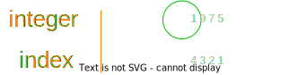
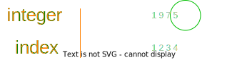
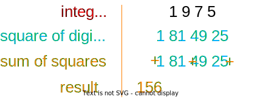
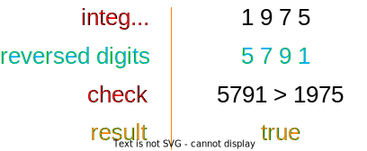
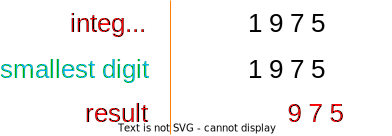
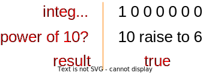
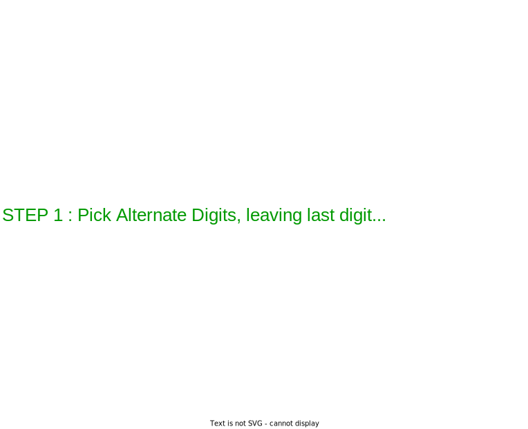

Just as I submitted my problem and got a green check across all the tests, I wondered - "How I could have improved it?"

There are often several ways to solve a problem. The most efficient solution is not the easiest for humans to understand and vice versa. So, best bet is finding a middle ground. One that would not make you go "What the heck does this do?" - When you get back to it after a year. Also, one that would probably not suck your CPU dry.

Few notes about this article,
1. You can find [Index](#index) at the bottom of this article, but I would suggest go blind and discover topics as discussed.
2. Although all code snippets are written in Python, concepts that are specific to Language are explained in the [Appendix](#appendix) below, just to keep this article generic.

This problem is relatively easy, it's a teeny tiny warm-up problem to get started with, if it seems too easy for your appetite, hold tight, upcoming ones would get gradually difficult!

While we go into depth of only one of the problem, I have provided an assorted set of problems that can be solved in a similar way.

Here's a quick look at all problems that you will be able to solve once you are thorough with this article 👉

1. [Nth Digit of an Integer](#problem--nth-digit-of-an-integer) **(Solution Provided Below)**
2. [Nth Digit of an Integer (counted from left)](#problem--nth-digit-of-an-integer-counted-from-left)
3. [Sum of Squares of all Digits](#problem--sum-of-squares-of-all-digits)
4. [Is Reverse Greater than Given Number](#problem--is-reverse-greater-than-given-number)
5. [Delete the Smallest Digit](#problem--delete-the-smallest-digit)
6. [Is Given number Power of 10](#problem--is-given-number-power-of-10)
7. [Implement Luhn Algorithm](#problem--implement-luhn-algorithm)

🏃 Enough talk, let's get to the problem!

# Problem : Nth Digit of an Integer
**Statement :** Given an integer find the digit at Nth place from right, assuming 1 is the Units place. E.g: If `Integer=1975` and `N=3`, then the output should be `9`. (This example would be considered in all the examples and illustrations below)

Here's a simple illustration to understand the above problem statement,



Some examples for you to better understand the problem,

```markdown
Input - Integer=`6382639` and N=`5`     | Output - `8`
Input - Integer=`7473392834` and N=`1`  | Output - `4`
Input - Integer=`69` and N=`2`          | Output - `6`
```

## Before We Start 
Here's an empty method description in python to get you started with. Just copy it over to your preferred editor, code in your solution and RUN IT! 


🦥 Feeling Lazy? Same problem is available on  with well defined test-cases.


```python
import unittest

def nth_digit_of_integer(integer, n):
    # write your logic here
    # start with the simplest thing that comes to your mind
    # it doesn't have to be fast, it doesn't have to be short
    # rather focus on getting the correct answer


# you may ignore the test definition below
class TestNthDigitOfInteger(unittest.TestCase):
    def test_with_proper_inputs(self):
        assert 9 == nth_digit_of_integer(1975, 3)
        assert 5 == nth_digit_of_integer(1975, 1)
        assert 6 == nth_digit_of_integer(654321, 6)

if __name__ == '__main__':
    unittest.main()
```

<br>

---
## ⏸️ Pause
Before reading the solutions, I would recommend you to pause and solve this yourself. Maybe this article includes and analyses one of your solutions or maybe you came up with a better solution. As some wise man once said - 

*The best way to learn to code is to DIY!*

---

<br>

## Solutions
### Solution 1 : Pythonic way
The most pythonic way to do it would be to convert integers to strings and get the negative Nth index. If you are not that familiar with Python you can find more on it here, [Appendix - Python : Strings and Indices](#python--strings-and-indices).
```python
# S1 - Pythonic Way
def nth_digit_of_integer(integer, n):
    # str() converts integer to string to make it traversable
    # [-n] negative index allows to traverse that string backwards
    # int() converts the fetched character string back to integer
    return int(str(integer)[-n])
```
Wow! That's a fancy one-line solution for sure. But the thing is it's not the most efficient way to do it, neither it's a generic solution.

### Solution 2 : Using Loop
Getting the last digit of any number is as simple as dividing the number by 10 and getting the remainder. Using this, every digit in an integer can be traversed by constantly reducing the integer (divide it by 10) and getting the last digit each time.
```python
# S2 - Using Loop
import math
def nth_digit_of_integer(integer, n):
    # logic can be understood better in the illustration below
    while n > 0:
        # mod (%) operator returns remainder after
        #   dividing by the number to it's right - here it's 10
        last_digit = integer % 10
        # math.floor() rounds any floating point value to
        #   an integer, such that integer is lower than the given float
        #   e.g: 
        #   math.floor(8.99) == 8
        #   math.floor(2.12) == 2
        integer = math.floor(integer / 10)
        n = n - 1
    return last_digit
```
*! [explainer](/opp-nth-digit-of-an-integer-explainer/#problem-1--solution-2-using-loop)*

This is a possible solution. It does get solved in O(n) time but there is an even better solution out there (no it's not recursion).

### Solution 3 : Using Recursion
Often recursion is not the best way to go by for solving problems, as they do more harm than good. This is due to the fact that, with each call there is a stack call made, which adds overhead to the solution. Still, they are extremely fun to implement. Same problem can also be solved using recursion as, 
```python
# S3 - Using Recursion
def nth_digit_of_integer(integer, n):
    if n == 1:
        return integer % 10
    else:
        return nth_digit_of_integer(integer // 10, n-1)
```
*! [explainer](/opp-nth-digit-of-an-integer-explainer/#problem-1--solution-3-using-recursion)*

Recursion works in ways similar to loops. Just instead of reducing inside a loop, we reduce and re-call the same function.

### Solution 4 : Mathematically
Usually the ones that is not easy to come up with, but also the ones that are the most efficient of all. If this is what you used to solve this problem, then kudos - "You are a mathematical Nerd!"
```python
# S4 - Mathematically
import math
def nth_digit_of_integer(integer, n):
    # below solution might seem complex at first but it is
    #   actually a lot simpler
    # here's an explainer, 
    #   math.pow(10, 3-1) -> returns 10 raise to 2 = 100
    #   1975 / 100 -> returns 19.75
    #   math.floor(19.75) -> returns 19
    #   19 % 10 -> returns 9
    return math.floor(integer / math.pow(10, n-1)) % 10
```
Also, these type of solutions are the most boring and requires you to have a really good mathematical fundamentals!  

That actually concludes this problem, but we still have issues in all our solutions. There are some input cases where our solution might break...

## Extra : Error Handling

Let's say, 
1. What if `N` provided is greater than our integer's digit size? 
2. What if `N` is `0` or a negative number like `-3`

Some of our solutions would certainly fail for them right? I will add a few more test-cases to cater to this scenario. Also since it's not clearly given in problem statement as to what to do in such cases, let's just return `-1`.

```python
# Nth Digit of an Integer
import unittest

def nth_digit_of_integer(integer, n):
    # write your logic here

class TestNthDigitOfInteger(unittest.TestCase):
    def test_with_proper_inputs(self):
        assert 9 == nth_digit_of_integer(1975, 3)
        assert 5 == nth_digit_of_integer(1975, 1)
        assert 6 == nth_digit_of_integer(654321, 6)
        assert -1 == nth_digit_of_integer(654321, 7)
        assert -1 == nth_digit_of_integer(654321, 0)
        assert -1 == nth_digit_of_integer(654321, -3) 

if __name__ == '__main__':
    unittest.main()
```
Take this up like an assignment, pick one of your favorite solution from above (or your own solution) and try to cater to newly added test-cases. 

*That concludes analysis of given problem.*

# Bonus Problems

## Problem : Nth digit of an Integer (counted from left)
**Statement :** Given an Integer find the digit at Nth place from left, with index starting from 1. E.g: If `Integer=1975` and `N=3`, then the output should be `7`.

**Illustration :**


**Sample Inputs :**
```markdown
Input - Integer=`6382639` and N=`5`     | Output - `6`
Input - Integer=`7473392834` and N=`1`  | Output - `7`
Input - Integer=`69` and N=`2`          | Output - `9`
```


## Problem : Sum of Squares of all Digits
**Statement :** Given an Integer find the sum of squares of all the Digits  E.g: If `Integer=1975`, then output should be `156` (`1` + `square(9)` + `square(7)` + `square(5)` = `1` + `81` + `49` + `25` = `156`)

**Illustration :**


**Sample Inputs :**
```markdown
Input - Integer=`234`   | Output - `29`
Input - Integer=`8492`  | Output - `165`
Input - Integer=`69`    | Output - `117`
```

## Problem : Is Reverse Greater than Given Number
**Statement :** Given an Integer, reverse the digits. If reversed integer is greater than original integer return true, else false. E.g: If `Integer=1975`, then reverse of it would be `5791`, which is greater than `1975` thus `True` should be returned. 

**Illustration :**


**Sample Inputs :**
```markdown
Input - Integer=`6382636`   | Output - `false`
Input - Integer=`12321`     | Output - `false`
Input - Integer=`69`        | Output - `true`
```

## Problem : Delete the Smallest Digit
**Statement :** Given an integer, delete the smallest digit and return the resulting integer. *In case of duplicates remove both.* E.g: If `Integer=1975`, smallest digit here is `1`, which should be removed. Thus `975` should be returned.

**Illustration :**


**Sample Inputs :**
```markdown
Input - Integer=`6382636`   | Output - `638636`
Input - Integer=`12321`     | Output - `232`
Input - Integer=`99`        | Output - `0`
```

## Problem : Is Given number Power of 10
**Statement :** Given an integer, check if it is a power of 10. E.g: If `Integer=1000000`, `10 power to 6` is `1000000`, thus `True` should be returned.

**Illustration :**


**Sample Inputs :**     
```markdown
Input - Integer=`10001000`  | Output - `false`
Input - Integer=`10`        | Output - `true`
Input - Integer=`69`        | Output - `false`
```

## Problem : Implement Luhn Algorithm
**Statement :** Luhn Algorithm is a check used to validate whether a credit card number is valid or not. 

Luhn algorithm has been explained in below illustration 👉

**Illustration :**

**Sample Inputs :**
```markdown
Input - Integer=`4263982640269299`  | Output - `true`
Input - Integer=`371449635398431`   | Output - `true`
Input - Integer=`1234567890`        | Output - `false`
```

That concludes this article. Thanks for your patience! ❤️

&nbsp;

# Appendix
## Python : Strings and Indices
Some Python features are really unique to the language, Strings can be traversed like a list and there are [negative indexes](/features-that-define-python#list--negative-indexing) in python. Explained in detail below,
```python
integer = 1975
# string conversion in python is simple, just call str() function
integer_str = str(integer) # integer_str contains '1975' string
# characters in strings can be accessed just like an array
integer_str[0] # this would return -> 1
integer_str[1] # this would return -> 9
# unlike other languages, python include negative indexes
# negative indexes are used to traverse an array/list/string in reverse
integer_str[-1] # this would return -> 5
integer_str[-2] # this would return -> 7
```

## Python : math.floor() and math.pow() shortcuts
Python does have some nifty tricks up it's sleeve. One of them are 2 commonly used operators that are unique to the language,
```python
import math
floored_float = math.floor(1975 / 10)
floored_float_2 = 1975 // 10
# (//) operator is similar to (/) division operator but
#   instead of returning a float, it returns a floored integer
#   this is quite useful in scenarios where only
#   quotient is expected out of a division
raise_to_2 = math.pow(10, 2)
raise_ro_2_operator = 10 ** 2
# (**) operator is alternative to math.pow()
```

<br>

# Index
- [Problem : Nth Digit of an Integer](#problem--nth-digit-of-an-integer)
  - [Before We Start](#before-we-start)
  - [⏸️ Pause](#️-pause)
  - [Solutions](#solutions)
    - [Solution 1 : Pythonic way](#solution-1--pythonic-way)
    - [Solution 2 : Using Loop](#solution-2--using-loop)
    - [Solution 3 : Using Recursion](#solution-3--using-recursion)
    - [Solution 4 : Mathematically](#solution-4--mathematically)
  - [Extra : Error Handling](#extra--error-handling)
- [Bonus Problems](#bonus-problems)
  - [Problem : Nth digit of an Integer (counted from left)](#problem--nth-digit-of-an-integer-counted-from-left)
  - [Problem : Sum of Squares of all Digits](#problem--sum-of-squares-of-all-digits)
  - [Problem : Is Reverse Greater than Given Number](#problem--is-reverse-greater-than-given-number)
  - [Problem : Delete the Smallest Digit](#problem--delete-the-smallest-digit)
  - [Problem : Is Given number Power of 10](#problem--is-given-number-power-of-10)
  - [Problem : Implement Luhn Algorithm](#problem--implement-luhn-algorithm)
- [Appendix](#appendix)
  - [Python : Strings and Indices](#python--strings-and-indices)
  - [Python : math.floor() and math.pow() shortcuts](#python--mathfloor-and-mathpow-shortcuts)
- [Index](#index)
