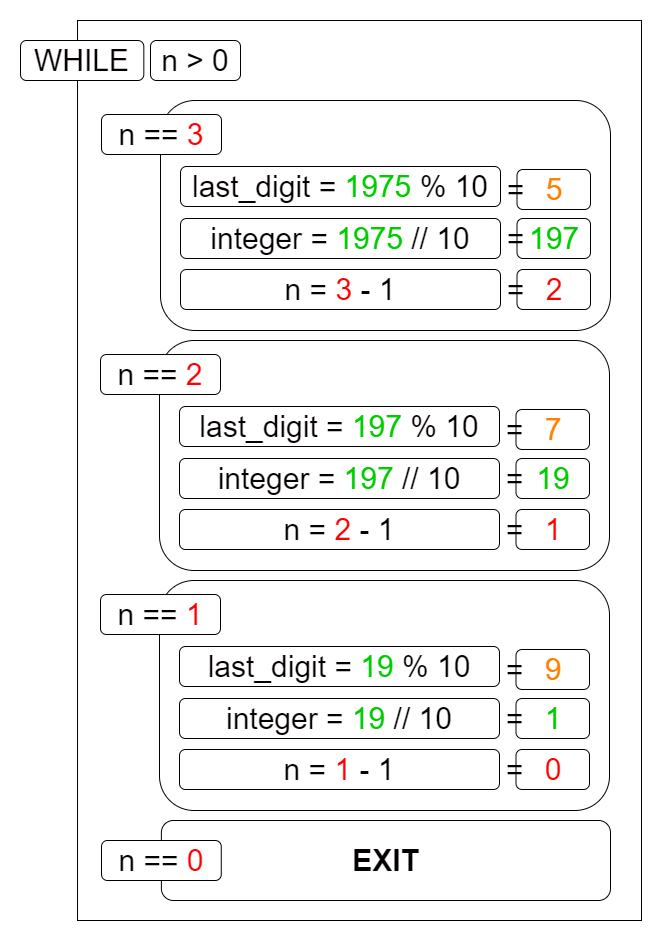
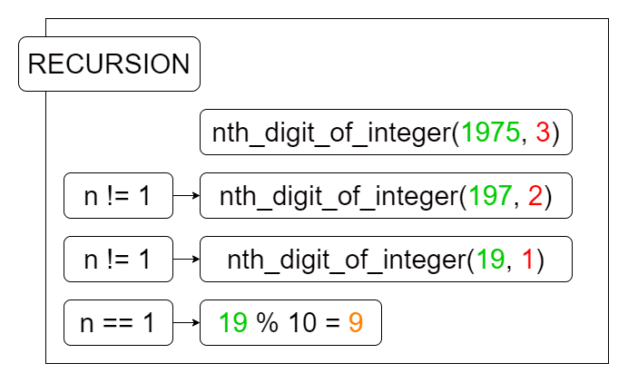

This is companion for [🧩 OPP | Nth Digit of an Integer](/opp-nth-digit-of-an-integer/). Includes solution and explainer for problems included in the mentioned blog.

# Problem 1 : Solution 2 (Using Loop)

```python
# S2 - Using Loop
import math
def nth_digit_of_integer(integer, n):
    # logic can be understood better in the illustration below
    while n > 0:
        # mod (%) operator returns remainder after
        #   dividing by the number to it's right - here it's 10
        last_digit = integer % 10
        # math.floor() rounds any foating point value to
        #   an integer, such that integer is lower than the given float
        #   e.g: 
        #   math.floor(8.99) == 8
        #   math.floor(2.12) == 2
        integer = math.floor(integer / 10)
        n = n - 1
    return last_digit
```

Here is an illustration detailing the logic above,


# Problem 1 : Solution 3 (Using recursion)

```python
# S3 - Using Recursion
def nth_digit_of_integer(integer, n):
    if n == 1:
        return integer % 10
    else:
        return nth_digit_of_integer(integer // 10, n-1)
```

Again an illustration to simplify this,
