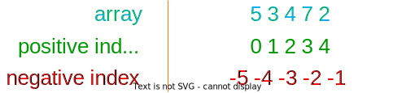
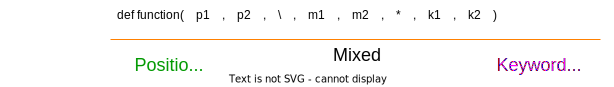

<br>  

Programming is all about - trying to implement something, getting stuck, googling "how to" & going Aaah!

I have been using python for quite some time now. I might not be the best developer out there, but certainly I am a lot better than how I had started. Here, I am compiling some of the things I learnt in the past few years of development.

<br>

# Index
1. [Generic \| Interpolated f-strings](#generic--interpolated-f-strings)
2. [Generic \| Multiple Assignment Unpacking](#generic--multiple-assignment-unpacking)
3. [List \| Slicing and Striding](#list--slicing-and-striding)
4. [List \| Negative Indexing](#list--negative-indexing)
5. [List \| List Comprehension](#list--list-comprehension)
6. [List \| enumerate(), zip() and itertools.ziplongest() Functions](#list--enumerate-zip-and-itertoolsziplongest-functions)
7. [Dictionary \| items(), keys() and values() Functions](#dictionary--items-keys-and-values-functions)
8. [Dictionary \| Handling Key Errors](#dictionary--handling-key-errors)
9. [Functions \| Positional and Named Arguments](#functions--positional-and-named-arguments)
10. [Functions \| Variable Arguments](#functions--variable-arguments)

<br>

## Generic \| Interpolated f-strings
There are often times when you need to print/write certain variables to console, file or web. This generally includes formatting variables in-between strings - "e.g: Last Element in list `[1,2,3,4,5]` is `5`". There are several ways to do this - using ,  and . But most of the above listed approaches are extremely verbose or hard to maintain. In order to solve those problems, f-strings were introduced in python 3.6. 

**Only supported in Python Version >= 3.6**, and is probably not the best way to go by if you are not sure about run-time python version of your deployment.

### Code Example:
Suppose you want to print *"First Element in list [1,2,3,4,5] is 1"*, you can do one of the following things,

Let's consider below list,
```python
arr = [1,2,3,4,5]
```

Using % Operator -

```python
print("First Element in List %s is %s" % (arr, arr[0]))
```

Using str.format() -

```python
print('First Element in List {} is {}'.format(arr, arr[0]))
# OR
print('First Element in List {0} is {1}'.format(arr, arr[0]))
# OR
print('First Element in List {arr} is {first_element}'.format(arr=arr, first_element=arr[0]))
```

Using f-strings - 

```python
arr = [1,2,3,4,5]
print(f'First Element in List {arr} is {arr[0]}')
# Now that's the cleanest of the lot, isn't it?
```

String formatting is not limited to just introducing a variable in-between string, you can do a variety of fancy things while formatting. Here is a  I made, in case you are curious.

### Reference Material:
- 
- 
- 

<br>

## Generic \| Multiple Assignment Unpacking
It's possible to return multiple values from a function using a special behavior of Python. Now, Python does not exactly allow multiple return values, but it can be done with a mix of returning a tuple and assigning it to multiple variables using multiple assignment unpacking feature. 

How does it exactly work though?
### Code Example:
In Python, Multiple variables can be assigned on a single line as,

```python
a,b = 1,2
```

Now if value on right is a `Tuple ()` or `List []` all values will be unpacked and individually assigned to each variable on left, this is called "Multiple Assignment Unpacking"

```python
a,b = [1,2]     # a=1 and b=2
a,b,c = [1,2,3] # a=1, b=2 and c=3
```

In case any value needs to be ignored `'_'` can be used

```python
_,b = [3,5] # b=5 and 3 will be ignored

a,_ = [4,6] # a=4 and 6 will be ignored

a,_,c = [4,6,8] # a=4, c=8 and 6 will be ignored
```

Suppose, you know a function can fail, but don't want to handle the error, instead return a default value on failure. Let's take an example of *division by zero error*, let's say you want to *return 0* on failure and also know if an error has occurred or not, you can return a `Tuple ()` as `(return_value, error)`.

```python
def get_division(a, b):
    try:
        a / b
    except Exception as e:
        return (0, e)
    return (a / b, None)

div, error = get_division(1,2)
div, error = get_division(1,0)
```

In examples we have seen so far, number of variables in left and values on right have been equal. 

Now what if number of variables on left and right differ?

```python
a,b = [1,2,3,4] # THIS WILL THROW AN ERROR!
#   -> ValueError: too many values to unpack (expected 2)

# But python does have one cool trick up it's sleeve,
a,*b = [1,2,3,4]   # a=1 and b=[2,3,4]

*a,b = [1,2,3,4]   # a=[1,2,3] and b=4

a,*b,c = [1,2,3,4] # a=1, b=[2,3] and c=4
```

### Reference Material:
- 
- 
- 

<br>

## List \| Slicing and Striding
In Python, strings are just like a list of characters. Which makes it possible to use list operations on strings as well. Slicing and Striding are one of the most useful feature of list, that can be used to extract certain portions of list.
### Code Example:
Let's take an example of below list,

```python
a = [1,2,3,4,5]
#   [0,1,2,3,4]   <- INDEX
```

Now when you say lists can be slices, it literally means that -

```python
a[1:3] # Returns [2,3]
    # Starts at index=1(inclusive), 
    # ends at index=3(exclusive)
a[:3] # Returns [1,2,3]
    # leaving start_index blank,
    # starts from first value (index 0)
a[2:] # Returns [3,4,5]
    # leaving end_index blank,
    # ends at the last value
```

You can also give a step value that is useful to step over certain values -

```python
a[1:4:2] # Returns [2,4]
# Starts at index=1 (i.e:2), 
# ends at index=4(exclusive) (i.e:4),
# steps over index=3(i.e:3)
```

This could be very confusing for first timers, here's some more example to make it easier to understand

```python
a[::2] # Returns [1,3,5], step=2 means skip every 1 value
a[::3] # Returns [1,4], step=3 means skip every 2 values
```

Slicing is especially useful if you want to extract certain characters from start or end of string. Let's say you need to return first 4 digits or last 4 digits of credit-card -

```python
credit_card = "4000056655665556"
credit_card[:4] # Returns '4000'
credit_card[12:] # Returns '5556'
# Credit-card number length can differ based on length,
# -> So this is not really a robust solution
```

#### ✍ Things to remember,
1. For slicing - `arr[start_index:end_index]`, where *start_index* is **inclusive** and *end_index* is **exclusive**.
2. For striding - `arr[start_index:end_index:step]`, where *step - 1* elements will be **skipped in-between**.  

### Reference Material:
- 
- 

<br>

## List \| Negative Indexing
Along with [slicing, striding](#list--slicing-and-striding) and negative indexing, any list can be easily reversed without using any functions.
### Code Example:
Let's take an example of below list,
```python
a = [5,3,4,7,2]
```

What is negative index? Well, in python It's possible to access a list from right to left (⬅) instead of left to right (➡) with a negative index,



```python
a[-1] # -> 2
a[-3] # -> 4
```

🤔 So how can you reverse a string?

```python
a[::-1] # -> [2,7,4,3,5]
# how cool is that? 😎
```

Working with negative index and slicing/striding

```python
a[-3:-1] # -> [4,7]
a[-1:-3:-1] # -> [2,7]
```

🛑 CAUTION! While negative indexes look cool they can introduce hard to debug bugs in your code... How you ask?

```python
len_a = len(a)
while True:
    try:
        print(a[len_a - 1])
        len_a -= 1
    except IndexError as ie:
        break
```
Instead of going out of index at index -1, due to negative indexing, it loops the list twice ->

```python
# prints each of the below in new line
# 2 7 4 3 5 2 7 4 3 5
```

While above example does seem far fetched, one might fall into this trap if they don't consider that index below *0* can be accessed in python, unlike other programming language.


### Reference Material:
- 
- 

<br>

## List \| List Comprehension
Python has "map()" and "filter()" methods to map or filter values in an iterable. Same can be done using list comprehensions, which is a more accessible and easy to understand version of the prior methods.

### Code Example: 
Consider following list,
```python
strings = ["to,","infinity","and","beyond!"]
```

🤔 Map : Convert all words in a list to upper case

```python
# With For Loops - 
capital_strings = []
for s in strings:
    capital_strings.append(s.upper())

# With List Comprehension - 
capital_strings = [s.upper() for s in strings]
```

🤔 Filter: Only fetch words with letter 'o'

```python
# With For Loops -
words_with_o = []
for s in strings:
    if 'o' in s:
        words_with_o.append(s)

# With list comprehension -
words_with_o = [s for s in strings if 'o' in s]
```

🤔 Map and Filter: Capitalize only words with 'o'
```python
# With For Loops -
capitalize_words_with_o = []
for s in strings:
    if 'o' in s:
        capitalize_words_with_o.append(s.capitalize())
    else:
        capitalize_words_with_o.append(s)

# With List Comprehension -
capitalize_words_with_o = [
    s.capitalize() if 'o' in s else s for s in strings
    ]
```

#### ✍ Things to Remember,
1. `[f(x) for x in sequence]`, here *f(x)* denote any function that can be applied, *x* is every element in *sequence* (List, Tuple, etc.)
2. `[f(x) for x in sequence if condition]`, here condition denotes any condition.
3. `[f(x) if condition else g(x) for x in sequence]`, where *g(x)* denotes any function defined in else construct.
4. While it's possible to work with nested lists using list comprehensions, I would advice against it. As it can quickly get unreadable and really inconvenient.

### Reference Material: 
- 
- 

<br>

# List \| enumerate(), zip() and itertools.ziplongest() Functions
"for" in python is pretty useful, while iterating through a list or dictionary. "range()" can be used to iterate over a certain range of integers. 

But what if, you had to iterate through an index as well as key of a list? What about iterating through 2 lists at the same time? Well python does provide some useful methods for just that -
### Code Example:
Consider following lists,
```python
names = ["Andy", "Buzz", "Jessie", "Rex", "Sid", "Bear"]
scores = [99,80,69,75,2]
```
Iterating through elements of an array 👉
```python
for score in scores:
  print(score)
```
 - Iterating through indexes and elements of an array 👉
```python
# parameter "start=N" governs where to 
# start fetching the data from
for index, score in enumerate(scores):
  print(index, score)
```

 - Iterating through multiple lists in the same loop 👉
```python
# "strict=True" will throw an error if there is length mismatch 
#   between two lists (available in python > 3.10)
for name, score in zip(names, scores):
  print(name, score)
```
While zip is pretty cool, it has a small gotcha. If one of the list is longer than other, it cuts off the data in longer list *i.e: in above list `"Bear"` entry would have been omitted while iterating.* 

```python
# Andy 99
# Buzz 80
# Jessie 69
# Rex 75
# Sid 2
```

In order to make sure there is no data loss, you can enable `strict=True` in zip, which will throw an error in such scenario. 

Or you can use  method that will instead use a default value to fill missing indexes. 
```python
from itertools import zip_longest
for name, score in zip_longest(names, scores, fillvalue=0):
  print(name, score)
```
This would now return `"Bear"` with fillvalue (i.e: 0).
```python
# Andy 99
# Buzz 80
# Jessie 69
# Rex 75
# Sid 2
# Bear 0
```

### Reference Material:
* 
* 

<br>

#  Dictionary \| items(), keys() and values() Functions
While dictionaries are not made to be accessed sequentially. Often times you are in a situation where you might have to. Python offers a few convenience features that allows to iterate over keys and values (or both) of a dictionary.

### Code Example:
Let's consider following dictionary,
```python
movie_ratings = {
  "Toy Story" : 8.3,
  "Toy Story 2" : 7.9,
  "Toy Story 3": 8.2,
  "Toy Story 4": 7.7
}
```
Iterate over keys in a dictionary,
```python
for key in movie_ratings.keys():
  print(key)  # will print keys in new line
```
Iterate over values in a dictionary,
```python
for value in movie_ratings.values():
  print(value)  # will print values in new line
```
Iterate over both keys and values in a dictionary,
```python
for key, value in movie_ratings.items():
  print(key, value)  # will print keys & values in new line each
```
🛑 CAUTION : Dictionary by default does not maintain order. So order in which keys/values are retrieved will not be same across systems. In case you need to maintain order for some reason, you should be using .
```python
from collections import OrderedDict
movie_ratings = OrderedDict({
  "Toy Story" : 8.3,
  "Toy Story 2" : 7.9,
  "Toy Story 3": 8.2,
  "Toy Story 4": 7.7
})
```
Above object will retain order and thus return keys/values in order it was defined or added.

### Reference Material:
* 
* 

<br>

# Dictionary \| Handling Key Errors
KeyError is thrown when the given dictionary is accessed using undefined key. 
```python
movie_ratings["Toy Story 5"]

# >>> Traceback (most recent call last):
# >>>   File "<stdin>", line 1, in <module>
# >>> KeyError: 'Toy Story 5'
```

In case you need to return a default value instead of an error. It's possible to use try catch to have a this behavior. But that's not a clean way to do it. 

In fact, there are 2 really good ways to handle this. One is defining a default value during dictionary definition and other defining a default value during access.

### Code Example:

Using  for assigning a default value during dictionary definition.
```python
from collections import defaultdict
release_year = defaultdict(
  lambda: None, {        # <- default will be set as None
    "Toy Story" : 1995,
    "Toy Story 2" : 1999,
    "Toy Story 3" : 2010,
    "Toy Story 4" : 2019
  })
release_year["Toy Story"]  # -> 1995
release_year["Shark Tale"]  # -> None
```
First argument "lambda: None" of defaultdict() will set the default value as "None". This can be set to any arbitrary value instead.

Using  method to define a default value on access.
```python
movie_ratings.get("Toy Story", 0) # -> 8.3
movie_ratings.get("Shark Tale", 0) # -> 0
```
Second argument "0" is the default value that will be fetched in case first argument key is not found in dictionary.
### Reference Material:
- 
- 

<br>

# Functions \| Positional and Named Arguments
Python functions can take 2 types of arguments - Positional and Named.  

Consider below function,
```python
def launch_rescue(speed, distance, countdown = 10):
  if distance/speed > countdown:
    return "Rescue FAILED!"
  return "Rescue SUCCESS!"
```

Any of the below calls will work  for above function,
```python
launch_rescue(2, 10)
launch_rescue(2, 10, countdown=10)
launch_rescue(2, 10, 10)
launch_rescue(2, distance=10, countdown=10)
launch_rescue(speed=2, distance=10, countdown=10)
```

Users are free to use any one of the above method calls, and result would be identical. While this offers flexibility, it could also be very confusing at times. 

So, some API developers impose a restriction that denotes certain arguments as positional-only and certain as keyword-only.

### Code Example:

Positional-only arguments 👉
```python
def launch_rescue(speed, distance, /, countdown = 10):
  # ...
```

*Adding a '/' will impose a restriction that any arguments BEFORE '/' must only be called as positional arguments.*
```python
launch_rescue(2, 10)  # <- Still Works
launch_rescue(2, 10, countdown=10)  # <- Still Works
launch_rescue(2, 10, 10) # <- Still Works

launch_rescue(2, distance=10, countdown=10) # <- DOESN'T WORK
launch_rescue(speed=2, distance=10, countdown=10) # <- DOESN'T WORK
```

Ok, now what if you also wanted 'countdown' to only be called as a keyword argument.

Keyword-only arguments 👉
```python
def launch_rescue(speed, distance, /, *, countdown = 10):
  # ...
```
*Adding a ‘\*’ will impose a restriction that any arguments AFTER ‘\*’ must only be called as keyword arguments.*
```python
launch_rescue(2, 10)  # <- Still Works
launch_rescue(2, 10, countdown=10)  # <- Still Works

launch_rescue(2, 10, 10) # <- DOESN'T WORK
launch_rescue(2, distance=10, countdown=10) # <- DOESN'T WORK
launch_rescue(speed=2, distance=10, countdown=10) # <- DOESN'T WORK
```

Other valid restrictions,
```python
def launch_rescue(speed, distance, *, countdown = 10):
  # mixed (both positional and keyword) -> speed & distance. 
  # keyword-only -> countdown
  # ...

def launch_rescue(speed, *, distance, countdown = 10):
  # mixed (both positional and keyword) -> speed. 
  # keyword-only -> distance (compulsory) & countdown
  # ...

def launch_rescue(speed, \, distance, *, countdown):
  # positional-only -> speed
  # mixed (both positional and keyword) -> distance. 
  # keyword-only -> countdown (compulsory)
  # ...
```

Quick reference,



### Reference Material:
* 
* 

<br>

# Functions \| Variable Arguments
'print()' function takes in unlimited number of positional arguments and somehow it magically prints everything. So how does it do it?

Well, python allows a function to take unlimited number of positional and keyword arguments called as Variable Arguments.
### Code Example:
Variable Positional Arguments 👉
```python
# this will extract and  print last name 
#   of provided character names
def character_last_names(*args): 
  for name in args:
    print(name.split(' ')[-1])
```
Now, positional arguments can be provided to function call.
```python
character_last_names(
  "Sheriff Woody", "Buzz Lightyear", "Rex"
  "Bo Peep", "Mr. Potato Head", "Slinky Dog"
)
```
Same can also be achieved by passing a list as a single argument instead of number of arguments, but this is a more cleaner way in my opinion. 

Variable Keyword Arguments also exists 👉
```python
# this will print character_name and voice_actor 
#   for a given character
def characters_va(**kwargs): 
  for character, va in kwargs.items():
    print(f"{character} voiced by {va}")
```
Now, keyword arguments can be provided to function call.
```python
characters_va(
  Woody="Tom Hanks", Buzz="Tim Allen", 
  Rex="Wallace Shawn", Bo="Annie Pots", 
  Potato="Don Rickles", Slinky=["Jim Varney", "Blake Clark"]
)
```
Again, same can be achieved by passing a dictionary as a single argument. But, This is more cooler right!

It's also valid to have both variable positional and keyword arguments,
```python
def movie_details(movie_name, *characters, **ratings):
  print(f"Movie: {movie_name}")
  print(f"Characters: {','.join(characters)}")
  print("Ratings:")
  for website, rating in ratings.items():
    print(f"{website} gave {rating}")

```
### Reference Material:
* 

<br>

That concludes the article. Hope, you got to learn something new here. 

Have a good day ❤️