I had decided to attempt AWS Solutions Architect Exam. So, after doing some initial learning, I went ahead and gave my first practice test. And... I bombed the VPC section! 

Then, I took it personally and read through every material I had. During this process I created my own little paper notes. This post includes those notes, just digitalized!

*To read through this, you might have to know the basics of AWS. At least an overview of all the services offered. I have tried to write it from a novice's perspective as much as possible. If you are reading this and could not understand any part, do contact me! I will try to improve it as much as possible.* 

*Also, feel free to save any diagrams given here, it's for your reference!*

*Any AWS Console Screenshots provided below might change in future, do keep that in mind.*

 

# Index
1. [Where is my data being stored?](#where-is-my-data-being-stored)
2. [How to make sure my resources are isolated?](#how-to-make-sure-my-resources-are-isolated)
3. [What should I take care of before deploying any resource?](#what-should-i-take-care-of-before-deploying-any-resource)
4. [How to identify my resource?](#how-to-identify-my-resource)
5. [How to reach my resource?](#how-to-reach-my-resource)
6. [What to do next?](#what-to-do-next)

 

## Where is my data being stored?
Amazon stores your data in blimps soaring through the sky, hence they are called cloud storage... 

Okay, Just Kidding! I don't expect you to fall for that. You must be at a level to understand that "cloud" is nothing but data centers managed by a third party (Amazon in this case). Amazon rents out these data centers for other companies to use. This service offering is called AWS. 

*You already knew that right... RIGHT?*

Renting out doesn't exactly mean allowing customers to manage a certain data center. AWS does it by running "Virtual Machines" over their physical machines. This allows them to provide a level of isolation that otherwise would not have been possible. In simple terms, they provide you storage and compute power over a network, while maintaining the actual infrastructure themselves. They do this in exchange for a fee, based on pay-as-you-go model!

Let's say, You want to run your application "Meme Generator" on AWS, you will need something called an EC2 Instance. In AWS, an EC2 instance is a computational unit, just like your own computer. Each instance has its own Memory and CPU, that enables you to run any job/application on it easily. This virtual machine could be running on any machine from AWS's data center. Your instance could even be running on the same hardware that is calculating a rocket's trajectory to Mars!

That's the power of Cloud!

Now, when you have a customer base like AWS, a single datacenter is not enough. So AWS has hundreds of them, spread across multiple continents. In order to make it easier to organize those datacenters, AWS has logically clustered them based on location -

1. One or Multiple **data centers** that are closely located are being called an **Availability Zone (AZ)** (N Data Centers 🔗 1 Availability Zone).
2. Two or More **Availability Zones (AZ)** that are located in the same general location are being called *Regions* (N Availability Zones 🔗 1 Region)

There are several benefits of this... 

Let's say a massive cyclone hit a particular AZ, what do you think will happen? 

Well, the location for each AZ has been chosen such that they are at least 60 miles (~96 km) apart! So even if an AZ goes down due to some catastrophe, there is a very low chance that some other AZ would be affected. Thus, there are multiple AZs to act as a backup for any failed AZ. So as long as your application is using services that are spread across multiple AZs you can say that your application is highly available.

This hierarchy of *Regions, AZs, and Data Centers* can be seen in the below illustration,

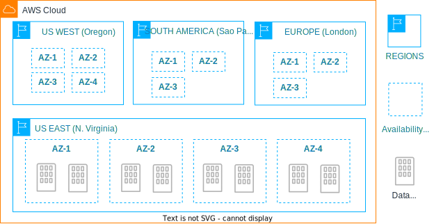

---

### ✍ Remember
1. Costs associated with resources differ from Region to Region, because AWS generally discounts in Regions where it's cheaper to operate a data center. 
2. Not all services are available in all the Regions.
3. AWS has separate Regions called *GovCloud* to be used by the US, only US Government organizations are allowed to use data centers in those Regions.
4. When you choose a region for provisioning your resources, just keep following parameters in your mind,
   - *Optimize Latency:* Make sure Users who will be primarily accessing your applications are closer to the region where you are provisioning your resource so that latency can be minimized. 
   - *Minimize Costs:* As previously said, some services are cheaper in certain Regions. While this difference is not significant, it should be one of your deciding factors.
   - *Address Regulatory Requirements:* Some governments have regulations that do not allow their citizen's data to be stored outside their country, such regulatory requirements must be considered as well.

---

## How to make sure my resources are isolated?
When you are running an organization, there are often requirements for multiple isolated environments. And isolation in this case would mean - resources running on one environment should not be able to access resources from some another environment. Only if there was a possibility to draw a box around our resources, such that it is contained only within that boundary. Well... that's where VPCs come in.

*VPC (or Virtual Private Cloud)* is a networking layer above your AWS resources, most of your AWS resources have to be assigned a VPC. With VPC, it's easier to govern how each of these resources communicate with each other and the world.

VPC has a physical boundary, *you cannot span VPCs across multiple Regions* (1 VPC 🔗 1 Region). All resources provisioned within a VPC will be created in the same Region only. Since a Region may include multiple AZs, a VPC may include multiple AZs (1 VPC 🔗 N AZ). Also, *a Region itself can have multiple VPCs under it* (1 Region 🔗 N VPC).

If VPC is not enough for logical isolation of your resources, you can also create Subnets within any VPC. Subnets (or subnetworks) are just VPCs divided into smaller networks. 

Association between Subnets and AZ is similar to that of VPC and Regions, *you cannot span Subnet across multiple AZs* (1 Subnet 🔗 1 AZ), all resources provisioned within a Subnet will be created in the same AZ. Also, *an AZ itself can have multiple Subnets under it* (1 AZ 🔗 N Subnets)

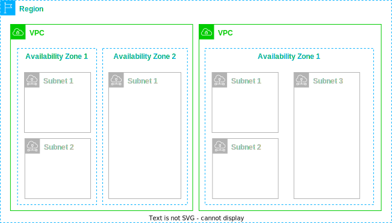

 

---

### ✍ Remember
1. When you first create an AWS account, you are provided with a default VPC along with a default Subnet.
2. You won't be charged to create or operate VPC, you will only be charged for resources that you provision within your VPC.
3. Also, remember the below rules,
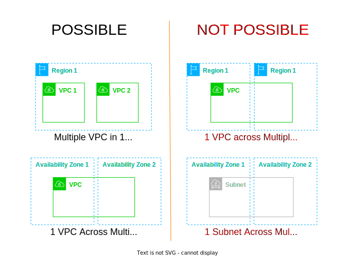

---
 

## What should I take care of before deploying any resource?
AWS has a lot of services, and its really impossible to remember what each of them do. Consider below diagram –

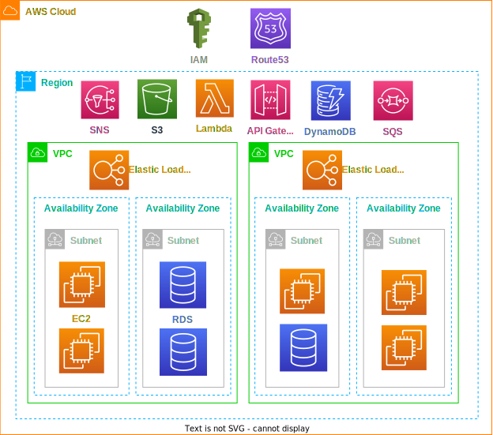

If you haven't heard of all the services yet, that's okay. Just revisit this once you go through them later. But do remember, its important to know – where your resource is getting deployed and how they interact with various levels of networking.

From the above diagram,
1. **EC2 Instances** and **RDS Instances** are deployed on an AZ. So when you create one, you need to choose one VPC and one Subnet for both.
2. **Elastic Load Balancers** are deployed in a Region but confined within a VPC, it can route traffic to multiple AZs at once. So when you create one, you need to choose one VPC and multiple Subnets.
3. **SNS, S3, Lambda, API Gateway, DynamoDB, and SQS** are all managed services by AWS, that is deployed on a Region. You only need to choose a Region and are not required to choose any VPC.
4. **IAM and Route53** are global services, that can be accessed from any Region.

AWS offers a lot of services, but I have only included the most important ones here. Before you go through any service, just try to read – how it interacts with various networking components of AWS. This can immensely help you in cracking your certification exam.

## How to identify my resource?
Usually, any computer which is connected over a network has an IP Address assigned to it. Using this IP Address it's possible to identify and communicate with it. Similarly, in AWS, every EC2 instance has an IP Address associated with it. In fact, there are 2 IP addresses, Private IP (for when communication is required to be done within VPC) and Public IP (for when an instance has to be accessed over the internet).

When you create your VPC you are asked to assign a CIDR block to it. Wondering what's that? Let me explain.

CIDR (Classless Inter-Domain Routing) is a method to allocate IP addresses for instances. With the help of CIDR, you can define a range within which the IP Address of instances will be. 

So how does a CIDR look like?

In the above example, your first 16 bits are assigned for the network (they act as a network identifier i.e: this part of your IP address cannot be modified) and the next 16 bits can be assigned to hosts (i.e: instances). 

Here are some examples to get started with,

- **`10.10.0.0/16`**  – `10.10.0.0` to `10.10.255.255` (65,536 Total IPs)

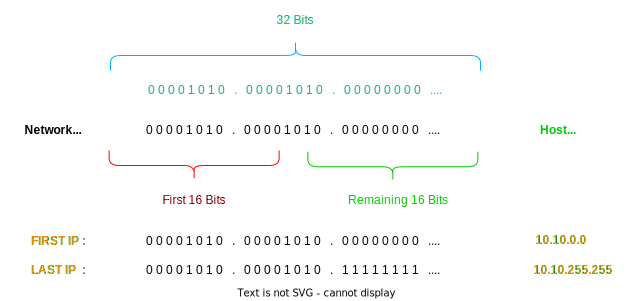

- **`172.16.0.0/12`** – `172.16.0.0` to `172.31.255.255` (1,048,576 Total IPs)

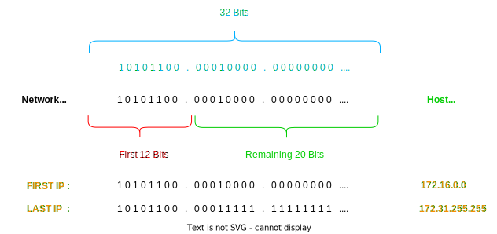

- **`192.168.0.0/28`** – `192.168.0.0` to `192.168.0.15` (16 Total IPs)

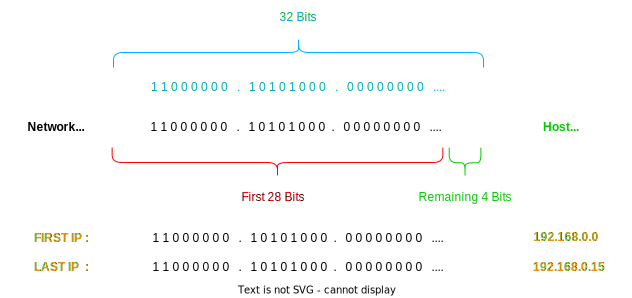

Hopefully, that made it clear. In case you want to quickly calculate this for any arbritary CIDR block, you can use this nifty tool – . This makes it easier to calculate the range of your CIDR block.

As I said, while creating a VPC you have to assign a CIDR block to it. This block decides the IP Addresses of hosts that will be provisioned within that VPC. 

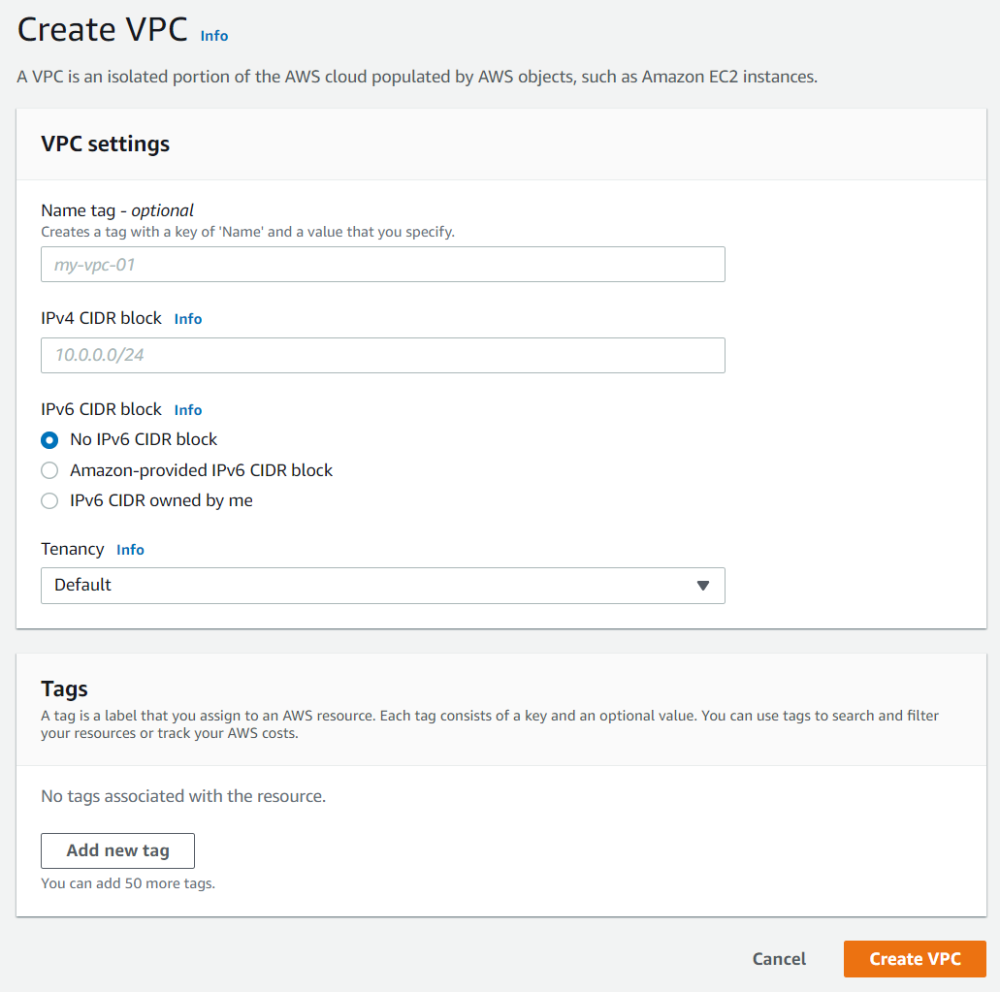

Similarly, when you create a Subnet, you will be asked to provide a CIDR block, this must be within the CIDR range of its parent VPC.

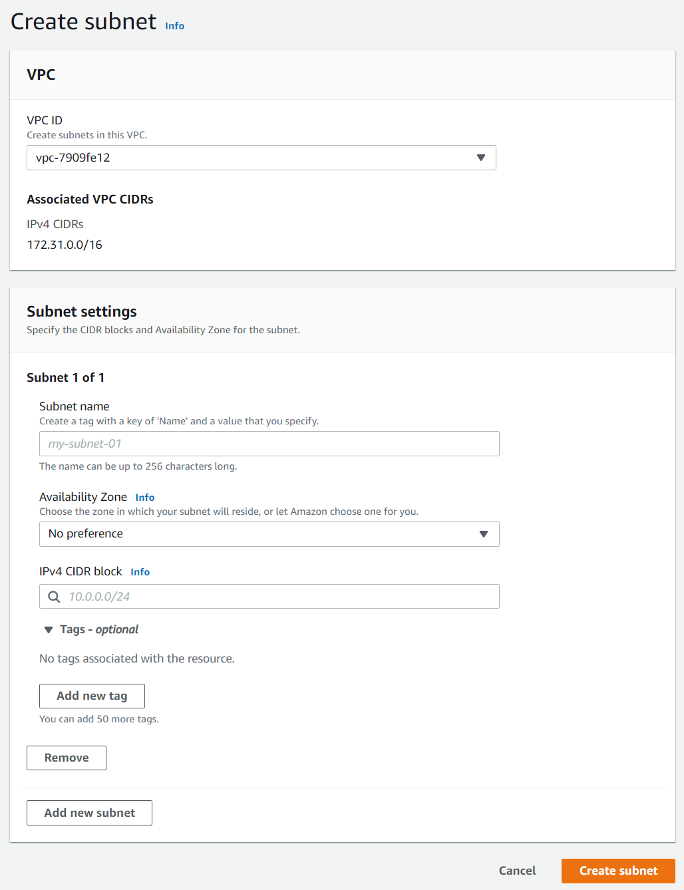

 

---

### ✍ Remember
1. The allowed CIDR Range in AWS is anywhere between `/16` and `/28`, which corresponds between 65,536 IPs and 16 IPs.
2. The above CIDR range is only for IPv4 addresses. It's also possible to set an IPv6 CIDR range, but it's not mandatory. In case you are new to networking, here's a nice video explaining it for you – 
3. Once a VPC is created with a certain CIDR range, you cannot modify it later. The only option you have is to create a new VPC as per the new requirement and migrate your application from an older VPC to a newer one.
4. **Important:** Whenever you create a Subnet, AWS reserves *the first four IPs* and *last IP* for internal networking purposes. So whenever you calculate the total available IPs you might have to *reduce 5 IPs* from that count, as those are reserved. (e.g: for `10.0.0.0/24`, following IPs are reserved – `10.0.0.1`, `10.0.0.2`, `10.0.0.3`, `10.0.0.4` and `10.0.0.255`, thus out of `256 IPs` only `251 IPs` are actually available.)

---
 

## How to reach my resource?
In networking, there are devices called Routers. 

Routers are like Maps 🗺️, they help machines discover other machines by providing the whereabouts of each other. Routers hold a table called Route Table, which acts exactly like an address book. When any machine tries to communicate with another machine, it looks into Route Table and gets directions.

AWS tries to hide this complexity, it does not expose any of its Routers for us to access. Instead, it does allow us to create and modify Route Tables to handle routing within our VPC. 

Whenever a VPC is created a Route Table is created along with it, this is usually known as Main Route Table. This Table by default includes an entry that allows traffic within VPC. This default entry is immutable, meaning that it cannot be modified or removed.

Whenever a Subnet is created, that Subnet is by default associated with parent VPC's Route Table. You can instead create a separate Route Table just for a certain Subnet as well. Subnet inherits all Routes added to VPC's Route Table.

So, how does a Route Table look like?

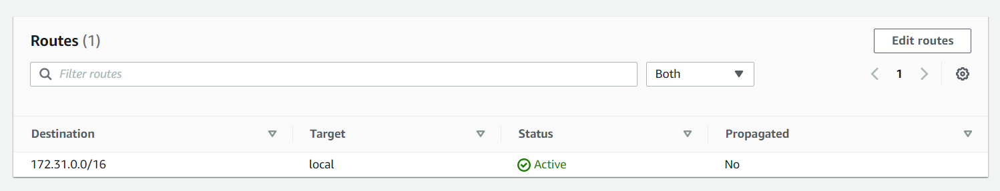

If you had created a VPC with CIDR `173.31.0.0/16`, entries in its Route Table will look like the one above.

As you can see, Route Table only consists of 2 columns that's of importance – Destination and Target. Whenever any instance tries to communicate with any IP address, that IP Address is looked-up in Route Table. If IP Address falls within the given CIDR range, traffic will be routed appropriately. 

With above configuration, any traffic with destination IP within the given CIDR range `173.31.0.0/16` will be forwarded to `local` which means it will be routed within VPC. 

With above configuration, let's say, an instance with IP `173.31.0.12` is trying to access an instance with IP `173.31.1.8` -

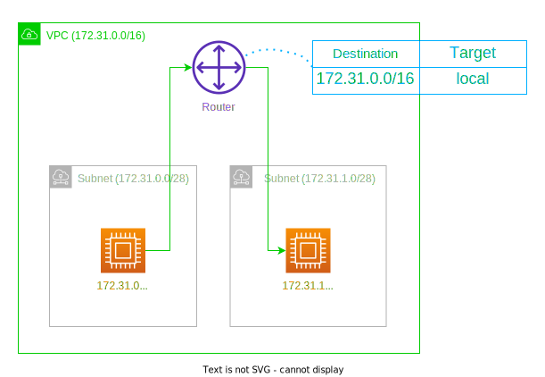

Route Table may not look very useful now, that is because we are yet to discuss various components that would require a Route Table entry to work. Which mostly include gateway services like – Internet Gateway (service that allows instances in VPC to access the internet), VPC Peering (service that allows instances to connect to your local infrastructure), and NAT Gateway (service that again allows instances to access the internet but without assigning a Public IP to instances).

 

---

### ✍ Remember
1. It is not possible to block access from one Subnet to another using Route Tables.
2. As discussed previously, You might also assign IPv6 CIDR to any VPC. Since this has to be separately configured, it also has to be separately present in your Route Table for internal routing with IPv6 address to work.
3. **Best Practice:** Keep the default Main Route Table with the local-only route. Each Subnet in that VPC should have its own Route Table with specific routes required for any particular use-case.

---
 

## What to do next?
The Only way to remember the concepts given here is to get your hands dirty. 

I would suggest going through this,  – Here you will learn to create a VPC, launch an instance into your VPC, assign Elastic IP to your instance and access your instance. I know we haven't discussed Elastic IP yet, still, there's no harm in going through the link and trying it out.

## That's it?
Yes, VPC is a lot more than what's covered in this article. We still haven't looked into networking services that enable internet connectivity like – Internet Gateway (IGW), Network Address Translation (NAT), Elastic IP Address (EIP), etc. And also services that allow you to connect VPC to your local network, allowing you to securely access any resource. Well, those are topics for another day. 

I promise to cover VPC in its entirety any time in the future!

Till then, Sayonara!