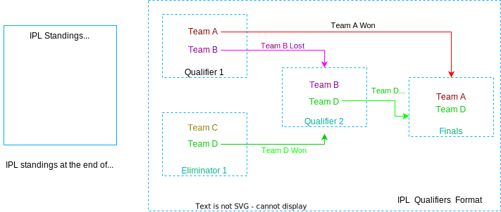
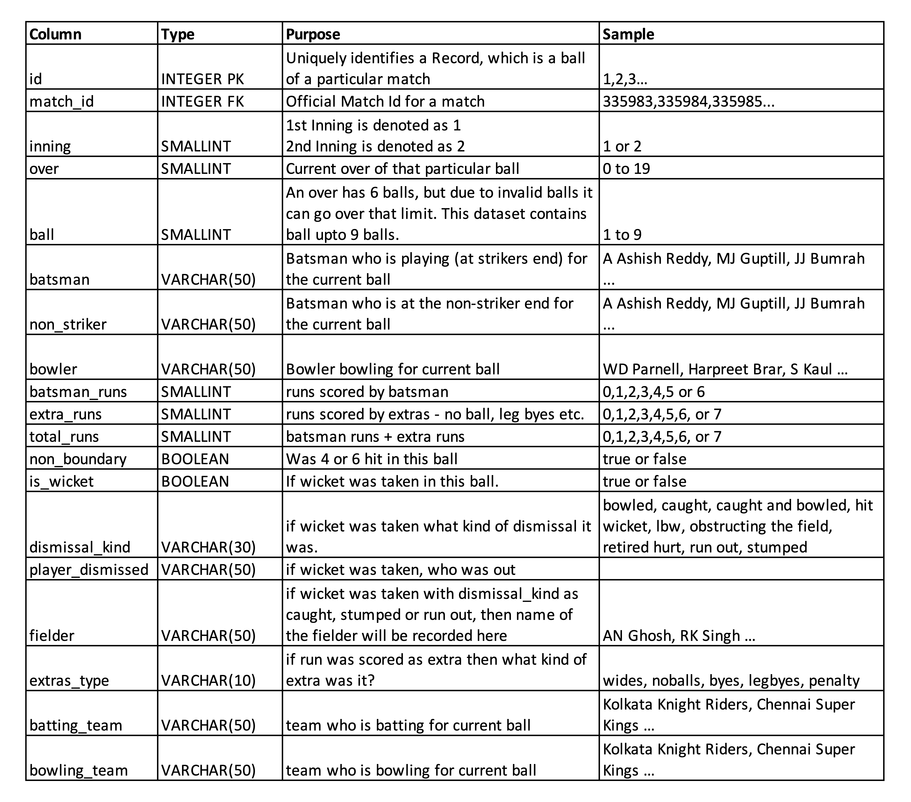

When I started learning SQL, it felt like the most easiest language out there. I had even falsely thought I had mastered it in a few days. Dear god, I was so wrong. More complex your questions are, more wide your dataset is, the more tricky your queries get.

Also, as a beginner it's really easy to know where to start but it's really hard to go ahead once you gain some level of understanding. Solving SQL problems requires you to think in a way which is quite different from solving other programming problems. 

This is not a Tutorial, but rather just a set of problems that should act as a bridge to more advanced topics of SQL. You should have some prior hands-on with SQL before you could continue solving the problems.

# What is IPL all about?

This post is entirely focused on analysis of IPL Dataset. If you are already an IPL fanatic, then just [skip](#house-rules) ahead. Otherwise  wikipedia page should be able to give you a basic understanding of the same.

And for those who would like to skip reading wiki, here's a tldr; for you *(this is a very quick intro and will be no way enough for you to understand the entire format properly, I would strongly suggest to do your part of study before going ahead)* -

The Indian Premier League (IPL) is a professional   league, contested by eight to ten . It is usually held between March and May of every year. There have been fourteen seasons of the IPL tournament so far, from . 

In League Phase, each team plays in a  format, with each team playing other team exactly twice, one at home ground and one away. At the conclusion of the league phase, the top four teams will qualify for the playoffs. 

In Playoff Phase, top two teams will play against each other in the first Qualifying match, with the winner going straight to the IPL final and the loser getting another chance to qualify for the IPL final by playing the second Qualifying match. Meanwhile, the third and fourth place teams from league phase play against each other in an eliminator match and the winner from that match will play the loser from the first Qualifying match. The winner of the second Qualifying match will move onto the final to play the winner of the first Qualifying match in the IPL Final match, where the winner will be crowned the Indian Premier League champions.

Here's a diagram, that visualizes the same - 

Now, it's okay even if it's not completely clear yet. Just having a basic understanding should be more than enough. I will try to give you enough context as and when questions are established later on...

# House Rules

Before we get to dataset, here are some rules to follow along while reading this blog -

1.  - clone this repository and keep it with you. 
2. **Make sure to look at solutions only after you have written yours down.** 
3. Code provided is written in PostgreSQL, while you are free to work with your prefered flavor of SQL. I would suggest you to install  for comparing solutions.
4. Dataset is available as part of above repositoy at  directory. Provided data is a cleaned version of dataset taken from 
5. You are free to look at the dataset and make sense of it on your own.
6. You will be able to setup your PostgresSQL with required tables by following instructions in above github readme.
7. Bonus questions are just as important as main question, try to solve both.
8. Look at Hints only if you are stuck (hover over grey-box for revealing them).
9. Each question may have multiple solutions, I will include any one of those working solution. As long as your solution matches "Expected Output" you are good to go!

# Unwinding the Dataset
There are 2 datasets available as part of this exercise,
1. **ipl_m_2008-2020.csv** : Contains records of all matches that were played from year 2008 to 2020.   

2. **ipl_byb_2008-2020.csv** : Contains a Ball-By-Ball record for each of the above matches. *We won't be using this table as a part of this exercise, so you are free to skip directly to problems.*

# Let's get Started!

## Problem 1 : Get the number of seasons
IPL has been held every year since 2008. A Season is nothing but the year on which an edition of IPL was held. Going by this, there have been 13 seasons till 2020. 

List all the seasons in `ipm_m` table.



Also, this `season` information is pretty useful. We will be using it frequently in upcoming problems.

Create a view that has all columns from `ipl_m` along with season information. Name this view as `v_ipl_m_with_season`.

**Bonus :** Count the total number of seasons.



**Solution :** 

## Problem 2 : Get all teams who participated for a given season
Teams have gone through several name changes and some teams didn't participate for certain seasons. Due to this, not all seasons have all the teams or there were some extra teams introduced midway. 

Define a variable called `season` initialize it with some year - say `2019`. List all teams that participated for that season from view `v_ipl_m_with_season`. 



**Bonus :** Get number of teams who participated in each season.



**Solution :** 

## Problem 3 : Get the team who won the most number of times
Retrieve the teams and their respective `win_count` in entirety of IPL. Also order by `win_count` so that it's clear, who won the most!



**Bonus :** Also try to retrieve `win_count` by `team` per `season`. Output should have 3 columns (`team`, `season` and `win_count`). Every row should only contain `win_count` for that `team` for that `season`. 



**Solution :** 

## Problem 4 : Get teams and maximum run margins for each team
Now, there are 2 columns which are of significance here - `result` and `result_margin`. Since we are looking for matches that has been won by defending *(winning team batted in 1st innings, put some runs on scoreboard and later in 2nd innings tried to defend that score)*, we should only focus on matches won by 'runs'.



**Bonus :** Get teams and minimum wicket margins for matches that have been won by chasing (i.e: when winning team batted in 2nd innings and tried to chase the score set by other team). Also make sure that this wicket margin is equal to or lower than 3.



**Solution :** 

## Problem 5 : Get the count of bat/field toss_decision for every venue
Cricket is a game where pitch condition and weather is as important as players of a team. This would act as one of factor in deciding whether to bat/field first. So winning a toss and making bat/field decision thereafter is equally important.

Get the Venue, Bat/Field Decision and corresponding win count for each decision made.



**Bonus :** Get an additional column of total number of wins for any particular decision.



**Solution :** 

## Problem 6 : Get total matches played by each team
While getting win_count for each team was easy, calculating total matches played by each team is slightly tricky. Each team has either played as team1 (home) or team2 (away). So you have to somehow combine data from 2 columns to aquire the required analytics.



**Bonus :** Some matches go till last ball or with last few wickets remaining. In order to get count of only such matches. Filter above data based on few additional parameters, was the match won with 3 runs or less of a margin or was the match won with 2 or less wickets.



**Solution :** 

## Problem 7 : Get the final match for a given season
Finals are one of the most watched match of the entire season regardless of teams playing. Try to retrieve the teams reaching the finals for any given season.



**Bonus :** Get final matches for each season, along with season column. 



**Solution :** 

## Problem 8 : Get league and playoffs (semi-finals and finals) for a given season 
League matches are played and top 4 teams get to playoffs, where they play eliminator type matches to get to finals. Now, getting this information is slightly tricky considering the fact that format of this was different before 2010. Before 2010 there were only 2 playoffs being played, which changed and 4 playoff matches are being played since (this format is explained [above](#what-is-ipl-all-about)). 

Using this info, add an extra column `match_type` that tags each match as - 'League', 'Playoffs' or 'Finals' depending on that match type. You may save this as a view called `v_ipl_m_with_match_type`



**Bonus :**  Get number of times each team has reached playoffs as `playoffs_played`, finals as `finals_played` and actually gone ahead and won finals as `finals_won`.



**Solution :** 

## Problem 9 : Get total matches played, matches won and win percentage per season
In order to find the most consistent team of IPL. It is not enough to find who won the most number of seasons. Instead you will require a metric called `win_percentage`. Which is calculated as `matches_played`/`matches_won`*100. Instead of finding overall metric, try to group the same as per season.



**Bonus :** Above data fetched is very difficult to analyse. It would have been much better if season were used as column names instead. Write a query that would display just `matches_won` for each team over seasons. 

Looking at below output should make it clear. 



As a preparation for final question, create a VIEW `v_aggregated_ipl_m` which will include following columns, `matches_played`, `matches_won`, `playoffs_played`, `finals_played`, `finals_won` aggregated over `team` and `season`. 

You must just have to extend the solution of "Problem 8 - Bonus" question. 



**Solution :** 

## Problem 10 : Get a wide column view of win_percentage of teams over season
Similar to getting `matches_won` in above bonus question, try to list `win_percentage`. You can use the above created VIEW `v_aggregated_ipl_m` for it.



**Bonus :** Real improvement/detorioration in performance can only be calculated if it is compared with last season's performance. We can consider `win_percentage` as a performance factor for the same. 

Try to retrieve the difference between a season's `win_percentage` figure with last season's figure. 

*e.g*: In below table for row value 'Chennai Super Kings' and year '2009' value is 0.89 which is calculated as, win_percentage(2009) - win_percentage(2008) -> (57.14 - 56.25 = 0.89)



**Bonus x2 :** Another performance measurement would be comparing each year's performance with each team's overall average performance.



**Solution :** 

&nbsp;

Now that concludes the first set of problems. This was mostly focused on `ipl_m` dataset. In second part, we would focus on a combination of both datasets, so expect more JOINS!

[Hit me up](/contact) with any queries or improved solutions to any of the above problems. I will make sure to resolve as many of your queries as possible.

Hope I was able to give you a challenging day! 