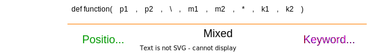

This is Part 2 of **Listed** Series. Make sure to have a look at [Part 1](/features-that-define-python) if you haven't already. This part covers some lesser known methods for lists, dict and functions that will make a developer's life easier.  

Let's just dive in! 

<br>

# Index
[Previous Part](/features-that-define-python#index)

- [Index](#index)
- [List \| enumerate(), zip() and itertools.ziplongest() Functions](#list--enumerate-zip-and-itertoolsziplongest-functions)
    - [Code Example:](#code-example)
    - [Reference Material:](#reference-material)
- [Dictionary \| items(), keys() and values() Functions](#dictionary--items-keys-and-values-functions)
    - [Code Example:](#code-example-1)
    - [Reference Material:](#reference-material-1)
- [Dictionary \| Handling Key Errors](#dictionary--handling-key-errors)
    - [Code Example:](#code-example-2)
    - [Reference Material:](#reference-material-2)
- [Functions \| Positional and Named Arguments](#functions--positional-and-named-arguments)
    - [Code Example:](#code-example-3)
    - [Reference Material:](#reference-material-3)
- [Functions \| Variable Arguments](#functions--variable-arguments)
    - [Code Example:](#code-example-4)
    - [Reference Material:](#reference-material-4)

<br>

# List \| enumerate(), zip() and itertools.ziplongest() Functions
"for" in python is pretty useful, while iterating through a list or dictionary. "range()" can be used to iterate over a certain range of integers. 

But what if, you had to iterate through an index as well as key of a list? What about iterating through 2 lists at the same time? Well python does provide some useful methods for just that -
### Code Example:
Consider following lists,
```python
names = ["Andy", "Buzz", "Jessie", "Rex", "Sid", "Bear"]
scores = [99,80,69,75,2]
```
Iterating through elements of an array 👉
```python
for score in scores:
  print(score)
```
 - Iterating through indexes and elements of an array 👉
```python
# parameter "start=N" governs where to 
# start fetching the data from
for index, score in enumerate(scores):
  print(index, score)
```

 - Iterating through multiple lists in the same loop 👉
```python
# "strict=True" will throw an error if there is length mismatch 
#   between two lists (available in python > 3.10)
for name, score in zip(names, scores):
  print(name, score)
```
While zip is pretty cool, it has a small gotcha. If one of the list is longer than other, it cuts off the data in longer list *i.e: in above list `"Bear"` entry would have been omitted while iterating.* 

```python
# Andy 99
# Buzz 80
# Jessie 69
# Rex 75
# Sid 2
```

In order to make sure there is no data loss, you can enable `strict=True` in zip, which will throw an error in such scenario. 

Or you can use  method that will instead use a default value to fill missing indexes. 
```python
from itertools import zip_longest
for name, score in zip_longest(names, scores, fillvalue=0):
  print(name, score)
```
This would now return `"Bear"` with fillvalue (i.e: 0).
```python
# Andy 99
# Buzz 80
# Jessie 69
# Rex 75
# Sid 2
# Bear 0
```

### Reference Material:
* 
* 

<br>

#  Dictionary \| items(), keys() and values() Functions
While dictionaries are not made to be accessed sequentially. Often times you are in a situation where you might have to. Python offers a few convenience features that allows to iterate over keys and values (or both) of a dictionary.

### Code Example:
Let's consider following dictionary,
```python
movie_ratings = {
  "Toy Story" : 8.3,
  "Toy Story 2" : 7.9,
  "Toy Story 3": 8.2,
  "Toy Story 4": 7.7
}
```
Iterate over keys in a dictionary,
```python
for key in movie_ratings.keys():
  print(key)  # will print keys in new line
```
Iterate over values in a dictionary,
```python
for value in movie_ratings.values():
  print(value)  # will print values in new line
```
Iterate over both keys and values in a dictionary,
```python
for key, value in movie_ratings.items():
  print(key, value)  # will print keys & values in new line each
```
🛑 CAUTION : Dictionary by default does not maintain order. So order in which keys/values are retrieved will not be same across systems. In case you need to maintain order for some reason, you should be using .
```python
from collections import OrderedDict
movie_ratings = OrderedDict({
  "Toy Story" : 8.3,
  "Toy Story 2" : 7.9,
  "Toy Story 3": 8.2,
  "Toy Story 4": 7.7
})
```
Above object will retain order and thus return keys/values in order it was defined or added.

### Reference Material:
* 
* 

<br>

# Dictionary \| Handling Key Errors
KeyError is thrown when the given dictionary is accessed using undefined key. 
```python
movie_ratings["Toy Story 5"]

# >>> Traceback (most recent call last):
# >>>   File "<stdin>", line 1, in <module>
# >>> KeyError: 'Toy Story 5'
```

In case you need to return a default value instead of an error. It's possible to use try catch to have a this behavior. But that's not a clean way to do it. 

In fact, there are 2 really good ways to handle this. One is defining a default value during dictionary definition and other defining a default value during access.

### Code Example:

Using  for assigning a default value during dictionary definition.
```python
from collections import defaultdict
release_year = defaultdict(
  lambda: None, {        # <- default will be set as None
    "Toy Story" : 1995,
    "Toy Story 2" : 1999,
    "Toy Story 3" : 2010,
    "Toy Story 4" : 2019
  })
release_year["Toy Story"]  # -> 1995
release_year["Shark Tale"]  # -> None
```
First argument "lambda: None" of defaultdict() will set the default value as "None". This can be set to any arbitrary value instead.

Using  method to define a default value on access.
```python
movie_ratings.get("Toy Story", 0) # -> 8.3
movie_ratings.get("Shark Tale", 0) # -> 0
```
Second argument "0" is the default value that will be fetched in case first argument key is not found in dictionary.
### Reference Material:
- 
- 

<br>

# Functions \| Positional and Named Arguments
Python functions can take 2 types of arguments - Positional and Named.  

Consider below function,
```python
def launch_rescue(speed, distance, countdown = 10):
  if distance/speed > countdown:
    return "Rescue FAILED!"
  return "Rescue SUCCESS!"
```

Any of the below calls will work  for above function,
```python
launch_rescue(2, 10)
launch_rescue(2, 10, countdown=10)
launch_rescue(2, 10, 10)
launch_rescue(2, distance=10, countdown=10)
launch_rescue(speed=2, distance=10, countdown=10)
```

Users are free to use any one of the above method calls, and result would be identical. While this offers flexibility, it could also be very confusing at times. 

So, some API developers impose a restriction that denotes certain arguments as positional-only and certain as keyword-only.

### Code Example:

Positional-only arguments 👉
```python
def launch_rescue(speed, distance, /, countdown = 10):
  # ...
```

*Adding a '/' will impose a restriction that any arguments BEFORE '/' must only be called as positional arguments.*
```python
launch_rescue(2, 10)  # <- Still Works
launch_rescue(2, 10, countdown=10)  # <- Still Works
launch_rescue(2, 10, 10) # <- Still Works

launch_rescue(2, distance=10, countdown=10) # <- DOESN'T WORK
launch_rescue(speed=2, distance=10, countdown=10) # <- DOESN'T WORK
```

Ok, now what if you also wanted 'countdown' to only be called as a keyword argument.

Keyword-only arguments 👉
```python
def launch_rescue(speed, distance, /, *, countdown = 10):
  # ...
```
*Adding a ‘\*’ will impose a restriction that any arguments AFTER ‘\*’ must only be called as keyword arguments.*
```python
launch_rescue(2, 10)  # <- Still Works
launch_rescue(2, 10, countdown=10)  # <- Still Works

launch_rescue(2, 10, 10) # <- DOESN'T WORK
launch_rescue(2, distance=10, countdown=10) # <- DOESN'T WORK
launch_rescue(speed=2, distance=10, countdown=10) # <- DOESN'T WORK
```

Other valid restrictions,
```python
def launch_rescue(speed, distance, *, countdown = 10):
  # mixed (both positional and keyword) -> speed & distance. 
  # keyword-only -> countdown
  # ...

def launch_rescue(speed, *, distance, countdown = 10):
  # mixed (both positional and keyword) -> speed. 
  # keyword-only -> distance (compulsory) & countdown
  # ...

def launch_rescue(speed, \, distance, *, countdown):
  # positional-only -> speed
  # mixed (both positional and keyword) -> distance. 
  # keyword-only -> countdown (compulsory)
  # ...
```

Quick reference,



### Reference Material:
* 
* 

<br>

# Functions \| Variable Arguments
'print()' function takes in unlimited number of positional arguments and somehow it magically prints everything. So how does it do it?

Well, python allows a function to take unlimited number of positional and keyword arguments called as Variable Arguments.
### Code Example:
Variable Positional Arguments 👉
```python
# this will extract and  print last name 
#   of provided character names
def character_last_names(*args): 
  for name in args:
    print(name.split(' ')[-1])
```
Now, positional arguments can be provided to function call.
```python
character_last_names(
  "Sheriff Woody", "Buzz Lightyear", "Rex"
  "Bo Peep", "Mr. Potato Head", "Slinky Dog"
)
```
Same can also be achieved by passing a list as a single argument instead of number of arguments, but this is a more cleaner way in my opinion. 

Variable Keyword Arguments also exists 👉
```python
# this will print character_name and voice_actor 
#   for a given character
def characters_va(**kwargs): 
  for character, va in kwargs.items():
    print(f"{character} voiced by {va}")
```
Now, keyword arguments can be provided to function call.
```python
characters_va(
  Woody="Tom Hanks", Buzz="Tim Allen", 
  Rex="Wallace Shawn", Bo="Annie Pots", 
  Potato="Don Rickles", Slinky=["Jim Varney", "Blake Clark"]
)
```
Again, same can be achieved by passing a dictionary as a single argument. But, This is more cooler right!

It's also valid to have both variable positional and keyword arguments,
```python
def movie_details(movie_name, *characters, **ratings):
  print(f"Movie: {movie_name}")
  print(f"Characters: {','.join(characters)}")
  print("Ratings:")
  for website, rating in ratings.items():
    print(f"{website} gave {rating}")

```
### Reference Material:
* 

<br>

That's it for now. Python does have more features to offer. I will update this page in case I publish a Part 3. 

Keep Learning! Keep practising! 🔥
