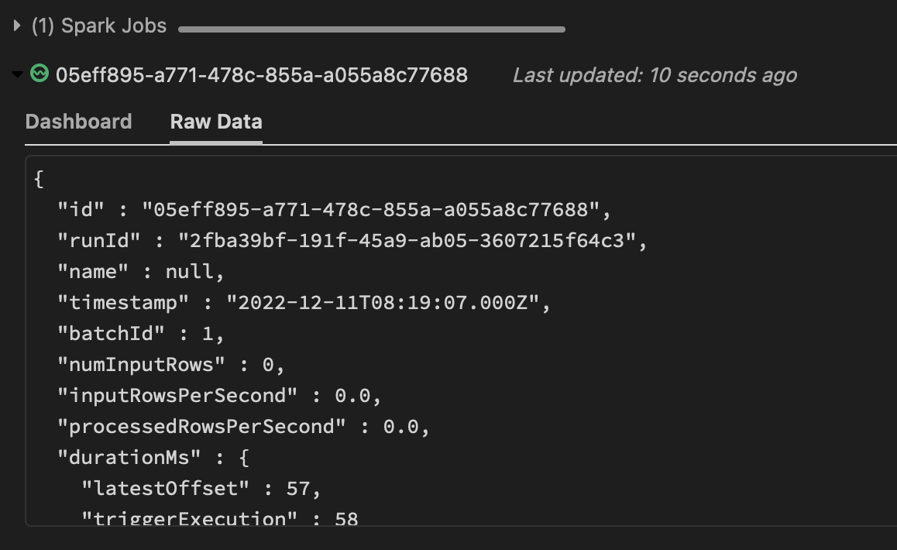

<br>

> Simon, from Advancing Spark, has an excellent video on this - [Advancing Spark - Databricks Delta Streaming](https://www.youtube.com/watch?v=-OQGEc09xbY). This post is inspired from there.

<p style="padding-top:2px;"></p>

# What is structured streaming anyway?

Let's take a scenario,

There is a huge table, with millions of rows. A new insert was made, now you need to join this data with another table to derive some final table. But traditional joins would read through entire incoming dataset (unless partitioned) and that will be really slow. 

Structured streaming basically allows you to just work with the new data which came in. This is called incremental processing. Reduced rows to process also means you can run you chunky transformation logic more often, which helps you design a near-realtime (or if optimized well, a realtime) system for performing ETL like jobs.

Now when you think about it, that's a brilliant idea. But, designing a structured streaming architecture is hard,

- How do you even know an insert/change was made? Read through database transaction logs maybe?
- How do you keep track of tables? For reading just the new rows next time?
- What if your record tracking system failed intermittently? That may re-process your data right?
- What if you changed your logic, and now you want to deliberately reprocess data?

You might have gotten the idea... So, in order to make our lives simpler, Spark provides a very high level structured streaming API which takes care of most of those nuances for us.

<br>

# What about delta tables?

It's a table format that supports best of both transactional and analytical systems. So, is it another file format like csv, parquet or orc? Well... no. 

It stores the actual data in parquet format and adds an extra layer on top of it. This layer stores the changes performed on delta table, i.e: it has an entire history of operations performed on it.

Each new change is preserved as a version. This enables it to perform some useful operations like time-travel (query the table as it was during a particular version) or restore to a previous version.

Parquet works on schema-on-read model, i.e: parquet itself does not enforce any schema on data. Delta works as a schema-on-write model instead, similar to a traditional database.

Some functionalities mentioned in this blog is that of delta while some are of structured streaming. I will mention which is of which as and when we learn them.

<br>

# Getting started

> It's possible to play around with spark on a free community Databricks instance. You can go ahead and create an account here - [community.cloud.databricks.com](https://community.cloud.databricks.com/). 

Sample data used here is available as part of Databrick's sample dataset. Use below syntax to browse them.

```python
display(dbutils.fs.ls('/databricks-datasets'))
```

> In case you are not working on Databricks, you can download it from [here](https://github.com/gauthamchettiar/gauthamchettiar.github.io/blob/ff291e75126007ef383ef875017e6f8b09a8ced4/content/posts/2022-12-01-delta-tables-reference/resources/databricks-flights-departuredelays.csv).

We will be using below paths, so let's initialize them now.

```python
csvInputPath = "/databricks-datasets/flights/departuredelays.csv"
deltaFullPath = "/mnt/dblake/BASE/Flights/Full"
deltaStreamInputPath = "/mnt/dblake/BASE/Flights/StreamInput"
deltaStreamOutputPath = "/mnt/dblake/BASE/Flights/StreamOutput"
```

- `csvInputPath` - Sample data we would be working with in CSV format.
- `deltaFullPath` - Sample data that we will be converting to delta format.
- `deltaStreamInputPath` - Full delta file has over a million records, in order to make testing easier we will create a subset (with 10 records) of full delta file.
- `deltaStreamOutputPath` - This will be the output/sink for our streaming job.

Some spark code to prepare our data,

```python
flightsDF = spark
    .read
    .format("csv")
    .option("header", True)
    .load(csvInputPath)

# setting .format("delta") will write it as a delta table
flightsDF
    .write
    .format("delta")
    .mode("overwrite")
    .save(deltaFullPath)

streamInputDf = flightsDF.limit(10)

streamInputDf
    .write
    .format("delta")
    .mode("overwrite")
    .save(deltaStreamInputPath)
```

Registering them as a table would help us quickly run queries later,

```sql
DROP TABLE IF EXISTS flights;
DROP TABLE IF EXISTS siflights;

CREATE TABLE flights USING delta LOCATION 
    '/mnt/dblake/BASE/Flights/Full';
CREATE TABLE siflights USING delta LOCATION 
    '/mnt/dblake/BASE/Flights/StreamInput';
```

<br>

## Doing a streaming read/write

From what we know about spark, 2 types of operations can be performed on a data frame,
1. Transformations : works lazily i.e: data frame is not triggered immediately.
2. Actions : actually triggers a job, any transformations defined on that data frame are now executed.

Similarly in streaming `.load` is a transformation (lazily evaluated) and `.start` is an action. Refer below code. 

<h2 id="streaming-python-code-bookmark"></h2>

```python
# readStream from a path
streamInput = spark
	.readStream
	.format("delta")
	.load(deltaStreamInputPath)

# writeStream to a path
streamOutput = streamInput
	.writeStream
	.format("delta")
	.option("checkpointLocation",
                f"{deltaStreamOutputPath}/_checkpoint")
	.start(deltaStreamOutputPath)
```

1. When above piece of code encounters `.start` it will start execution of a spark structured streaming job.
2. Streaming job would continuously read data from input stream `deltaStreamInputPath` and write changes to output stream `deltaStreamOutputPath` forever.
3. `checkpointLocation` is where spark stores data regarding it's stream progress, i.e: what all records has been read so far (more on this later).

Assuming you are running it on Databricks, a streaming process like this should be triggered,



And this is a full snippet of that Raw Data,
```json
{
  "id" : "afb5b7e7-1b8a-474f-ae0b-6f1449633cde",
  "runId" : "a95b3baa-cbdc-4895-8b11-a3bbaf2e768e",
  "name" : null,
  "timestamp" : "2022-11-30T06:53:44.754Z",
  "batchId" : 0,
  "numInputRows" : 10,
  "inputRowsPerSecond" : 0.0,
  "processedRowsPerSecond" : 1.7427675148135238,
  "durationMs" : {
    "addBatch" : 3149,
    "getBatch" : 52,
    "latestOffset" : 1395,
    "queryPlanning" : 7,
    "triggerExecution" : 5738,
    "walCommit" : 508
  },
  "stateOperators" : [ ],
  "sources" : [ {
    "description" : "DeltaSource[dbfs:/mnt/dblake/BASE/Flights/StreamInput]",
    "startOffset" : null,
    "endOffset" : {
      "sourceVersion" : 1,
      "reservoirId" : "ac701d34-db41-44ed-99ab-8e23614d6c6a",
      "reservoirVersion" : 0,
      "index" : 0,
      "isStartingVersion" : true
    },
    "latestOffset" : null,
    "numInputRows" : 10,
    "inputRowsPerSecond" : 0.0,
    "processedRowsPerSecond" : 1.7427675148135238,
    "metrics" : {
      "numBytesOutstanding" : "0",
      "numFilesOutstanding" : "0"
    }
  } ],
  "sink" : {
    "description" : "DeltaSink[/mnt/dblake/BASE/Flights/StreamOutput]",
    "numOutputRows" : -1
  }
}
```

That's a lot to take in! Here's a condensed version with only metrics relevant for us,
```json
{
  "batchId" : 0,
  "numInputRows" : 10,
  "sources" : [ {
    "description" : "DeltaSource[dbfs:/mnt/dblake/BASE/Flights/StreamInput]",
    "startOffset" : null,
    "endOffset" : {
      "reservoirVersion" : 0,
      "isStartingVersion" : true
    }
  } ],
  "sink" : {
    "description" : "DeltaSink[/mnt/dblake/BASE/Flights/StreamOutput]"
  }
}
```

1. `"numInputRows" : 10` - This indicates that 10 rows were read from source. 
2. `"startOffset" : null` - This indicates that stream is being read from beginning.
3. `"endOffset" -> "reservoirVersion" : 0` - Last read version is 0, indicating that only one change was done at source.
4. `"sources" -> "description" : "DeltaSource[dbfs:/mnt/dblake/BASE/Flights/StreamInput]"` - Path of source delta table.
5. `"sink" -> "description" : "DeltaSink[/mnt/dblake/BASE/Flights/StreamOutput]"` - Path of output/sink delta table.

Now if you insert rows into inputStream table, outputStream would read it and update it's own records.
```sql
-- below query inserts 10 random rows from flights to sflights
INSERT INTO siflights
SELECT * FROM flights ORDER BY rand() limit 5;
```

OutputStream raw data (condensed):
```json
{
  "batchId" : 1,
  "numInputRows" : 5,
  "sources" : [ {
    "description" : "DeltaSource[dbfs:/mnt/dblake/BASE/Flights/StreamInput]",
    "startOffset" : {
      "reservoirVersion" : 0,
      "isStartingVersion" : true
    },
    "endOffset" : {
      "reservoirVersion" : 2,
      "isStartingVersion" : false
    },
    "numInputRows" : 5
  } ],
  "sink" : {
    "description" : "DeltaSink[/mnt/dblake/BASE/Flights/StreamOutput]"
  }
}
```

1. `"startOffset"  -> "reservoirVersion" : 0` - This indicates that stream was already read previously and now it's being read after a certain offset.

As per above [python](#streaming-python-code-bookmark) code, Input and Output Stream will always be in Sync (as long as above streaming process is kept running). Every time data is inserted into InputStream it will be read by OutputStream and update it's own data.

By default above stream will check for new data every `10 second`. Now if you want to change this you can use `trigger` - 

```python
streamOutput = streamInput
	.writeStream
	.format("delta")
	.trigger(continuos="30 minute")
	.start(deltaStreamOutputPath)
```

<br>

## Running your stream only once
if your data is not coming in that frequently, it's not necessary to run a stream every X interval. So Spark streaming also has a provision to run your stream once by setting `.trigger(once=True)`.

It will aggregate all changes that were done since last streamingQuery was run into a single batch and update the same at `deltaStreamOutputPath`.

```python
streamInput = spark
	.readStream
	.format("delta")
	.load(deltaStreamInputPath)

streamOutput = streamInput
	.writeStream
	.format("delta")
	.option("checkpointLocation", 
        f"{deltaStreamOutputPath}/_checkpoint")
	.trigger(once=True)     # this will trigger stream only once
	.start(deltaStreamOutputPath)
```

<br>

## What is a checkpoint ?

We have been passing an option `.option("checkpointLocation", checkpoint_path)` to writeStream. But what is it exactly? 

So, A Checkpoint keeps track of records that has been processed so far. Next time when a stream is triggered, it will refer this checkpoint folder to ensure that only new changes are read.

### What will happen when you change/delete your checkpoint folder?
1. Any progress is lost, and stream's read position will be reset.
2. This will process the data from beginning and re-process any data that was already processed.

So, for our use case, if we delete our checkpoint folder and re-run streaming, there would be duplicate records written in output stream. *You can try this out in your environment.*

### What if we don't want it to be processed from beginning?

For such use cases, it's also possible to start processing incoming stream from an arbitrary version -

```python
streamInput = spark
	.readStream
	.format("delta")
	.option("startingVersion", 2)
	.load(deltaStreamInputPath)
```

... also from an arbitrary timestamp, such that any changes made after that timestamp would be processed -

```python
streamInput = spark
	.readStream
	.format("delta")
	.option("startingTimestamp", "2022-01-01T00:00:00.000Z")
	.load(deltaStreamInputPath)
```


<br>

# Making updates instead of inserts
We have been inserting into source table so far. But what if we do an update instead? 

Suppose, our Input Stream table has following data -

| date     | delay | distance | origin | destination |
| -------- | ----- | -------- | ------ | ----------- |
| 01020600 | -8    | 369      | ABE    | DTW         |
| 01020605 | -4    | 602      | ABE    | ATL         |

And we run following update,
```sql
UPDATE siflights
SET distance = 111 WHERE origin = 'ABE'
```

And we get the new records as,
| date     | delay | distance | origin | destination |
| -------- | ----- | -------- | ------ | ----------- |
| 01020600 | -8    | 111      | ABE    | DTW         |
| 01020605 | -4    | 111      | ABE    | ATL         |

Now, when you try to run the stream again it will throw an error -

`java.lang.UnsupportedOperationException: Detected a data update (for example part-00000-2e420b58-d394-487e-99fd-e7cf921f3441-c000.snappy.parquet) in the source table at version 7. This is currently not supported. If you'd like to ignore updates, set the option 'ignoreChanges' to 'true'. If you would like the data update to be reflected, please restart this query with a fresh checkpoint directory.`


This happens because, **Delta currently does not support updates.** 

For above scenario to work, as suggested in above error we can add below option to `readStream` :
```python
streamRead = spark
	.readStream
	.format("delta")
	.option("ignoreChanges", True)
	.load(deltaSmallPath)
```

This will append updates performed as new rows in `outputStream`.


| date     | delay | distance | origin | destination |
| -------- | ----- | -------- | ------ | ----------- |
| 01020600 | -8    | 369      | ABE    | DTW         |
| 01020605 | -4    | 602      | ABE    | ATL         |
| 01020600 | -8    | 111      | ABE    | DTW         |
| 01020605 | -4    | 111      | ABE    | ATL         |

But, this is not ideal, as you were expecting an update. But here updates are being appended as a new row instead. 

This issue can be solved with a `merge` operation. (more on that later).

<br>

# What about deletes instead of updates?
Make a guess, what do you think will happen?

Suppose, input stream table - 

| date     | delay | distance | origin | destination |
| -------- | ----- | -------- | ------ | ----------- |
| 01020600 | -8    | 369      | ABE    | DTW         |
| 01020605 | -4    | 602      | ABE    | ATL         |
| 02011300 | 79    | 905      | GRR    | TPA         |


And we run following update,

```sql
DELETE FROM siflights
WHERE origin = "ABE";
```

Now inputStream will have - 

| date     | delay | distance | origin | destination |
| -------- | ----- | -------- | ------ | ----------- |
| 02011300 | 79    | 905      | GRR    | TPA         |

Now, when you try to run the stream again without any options, as expected, it will throw an error -

`java.lang.UnsupportedOperationException: Detected deleted data (for example part-00000-4e309c2a-72a4-4526-a159-fdb6e7b8acdc-c000.snappy.parquet) from streaming source at version 2. This is currently not supported. If you'd like to ignore deletes, set the option 'ignoreDeletes' to 'true'.`

As suggested let's try with `ignoreDeletes` option,

```python
streamRead = spark
	.readStream
	.format("delta")
	.option("ignoreDeletes", True)
	.load(deltaSmallPath)
```

And again as expected, this will do nothing and keep the data as is.

| date     | delay | distance | origin | destination |
| -------- | ----- | -------- | ------ | ----------- |
| 01020600 | -8    | 369      | ABE    | DTW         |
| 01020605 | -4    | 602      | ABE    | ATL         |
| 02011300 | 79    | 905      | GRR    | TPA         |

Stream does increment the `reservoirVersion` though,

```json
{
  "batchId" : 1,
  "numInputRows" : 0,
  "sources" : [ {
    "startOffset" : {
      "reservoirVersion" : 1,
    },
    "endOffset" : {
      "reservoirVersion" : 2,
    }
}
```

Unlike updates, deletes are usually not needed to be propagated to an OLAP service. 

<!-- What to do if you want to propagate delete? -->

<br>

# Working with Delta Metadata

It's possible to get a lot of metadata information from delta tables.

Since we are storing `writeStream` output to a variable (`streamOnceQuery`) we can use that object to get information about the streaming query.

Below query would give you the json output like the one you get after you finish your query,
```python
streamOnceQuery.recentProgress[0]
```

Also you get a complete history of changes that were done on a delta table using,
```sql
describe history siflights;
```

Which should print below result,

<div class="horizontalScroll">

| version | timestamp                    | userId          | userName                  | operation | operationParameters                                                    | job  | notebook                        | clusterId            | readVersion | isolationLevel    | isBlindAppend | operationMetrics                                                                                                                                                                  | userMetadata | engineInfo                          |
|---------|------------------------------|-----------------|---------------------------|-----------|------------------------------------------------------------------------|------|---------------------------------|----------------------|-------------|-------------------|---------------|-----------------------------------------------------------------------------------------------------------------------------------------------------------------------------------|--------------|-------------------------------------|
| 3       | 2022-12-11T14:26:23.000+0000 | 884323947861202 | user | UPDATE    | {"predicate":"(destination#14797 = ATL)"}                              | null | {"notebookId":"83090234805123"} | 1211-105641-l4t9ltnh | 2           | WriteSerializable | FALSE         | {"numRemovedFiles":"1", "numCopiedRows":"3", "numAddedChangeFiles":"0", "executionTimeMs":"1964", "scanTimeMs":"62", "numAddedFiles":"1", "numUpdatedRows":"2", "rewriteTimeMs":"1898"}  | null         | Databricks-Runtime/10.4.x-scala2.12 |
| 2       | 2022-12-11T13:56:41.000+0000 | 884323947861202 | user | DELETE    | {"predicate":"[\"(spark_catalog.default.siflights.origin = 'ABE')\"]"} | null | {"notebookId":"83090234805123"} | 1211-105641-l4t9ltnh | 1           | WriteSerializable | FALSE         | {"numRemovedFiles":"1", "numCopiedRows":"0", "numAddedChangeFiles":"0", "executionTimeMs":"1347", "numDeletedRows":"10", "scanTimeMs":"818", "numAddedFiles":"0", "rewriteTimeMs":"528"} | null         | Databricks-Runtime/10.4.x-scala2.12 |
| 1       | 2022-12-11T13:56:11.000+0000 | 884323947861202 | user | WRITE     | {"mode":"Append", "partitionBy":"[]"}                                   | null | {"notebookId":"83090234805123"} | 1211-105641-l4t9ltnh | 0           | WriteSerializable | TRUE          | {"numFiles":"1", "numOutputRows":"5", "numOutputBytes":"1657"}                                                                                                                      | null         | Databricks-Runtime/10.4.x-scala2.12 |
| 0       | 2022-12-11T13:56:01.000+0000 | 884323947861202 | user | WRITE     | {"mode":"Overwrite", "partitionBy":"[]"}                                | null | {"notebookId":"83090234805123"} | 1211-105641-l4t9ltnh | null        | WriteSerializable | FALSE         | {"numFiles":"1", "numOutputRows":"10", "numOutputBytes":"1727"}                                                                                                                     | null         | Databricks-Runtime/10.4.x-scala2.12 |

Scroll >>>>>>

</div>

**There's a few more things to be covered in delta, will be updating here...**