<br>

Yes, I am late to the party! ChatGPT had been in news for more than a month now. I had been holding back from testing it mainly because I was a bit skeptical, my previous experience with conversational AIs were not that great. But here I am now, finally giving in to the hype... And boy! It exceeded my expectations.

So internet is already overflowing with articles on how to make and break ChatGPT. Here's some of my favorites -

-  
- 
- 
-  
-  
-   


While people have tried to use it for more nobler purpose \*cough\* disputing a parking fine \*cough\*. I have a far more mundane purpose. I wanted to see if ChatGPT can draw. 

Well, it's elder cousin  certainly does a good job of drawing with prompts, I wanted to know if ChatGPT can do it. 

But how? Even I had no clue, so I did the most logical thing. I asked ChatGPT...

<table> <td style="background-color:#251749;border:none;">

<div style="margin:15px;margin-bottom:20px">

**PROMPT:** how can you draw?

As an artificial intelligence, I don't have the ability to draw in the same way that a human does. I don't have physical hands or other tools that I can use to create visual art. Instead, I can generate text-based descriptions of images or use programming languages such as Python to create digital images using libraries like pillow.

For example, I can use code like this to draw a simple image using the pillow library in Python:

```python
from PIL import Image, ImageDraw

# Create a new image with a white background
image = Image.new('RGB', (400, 400), 'white')

# Create a drawing context
draw = ImageDraw.Draw(image)

# Draw a red circle
draw.ellipse((100, 100, 300, 300), fill='red')

# Save the image
image.save('circle.png')
```

This code creates a new image with a white background, and then uses the pillow library's Draw object to draw a red circle on it. Finally, it saves the image to a file named circle.png.

I hope this helps to explain how I can "draw" using programming languages and libraries like Python and pillow. Let me know if you have any other questions!

---

Image generated by above code,


</div>
</td> </table>


Fair enough. Now time to exploit this new found knowledge!

Keeping christmas spirit in mind I asked ChatGPT -

<table> <td style="background-color:#251749;border:none;">
<div style="margin:15px;margin-bottom:20px;">

**PROMPT:** generate an image of santa.

I'm sorry, but I am unable to generate images. However, I can tell you that Santa Claus, also known as Saint Nicholas, Kris Kringle, or simply Santa, is a legendary figure who is said to bring gifts to the homes of well-behaved children on Christmas Eve. He is often depicted as a jolly old man with a white beard, red suit, and black boots, carrying a bag of gifts. In many Western cultures, children leave out cookies and milk for Santa on Christmas Eve, and he is also said to have a team of reindeer that help him deliver presents to children around the world.

</div>
</td> </table>

Okay, that didn't work as expected. Let me rephrase it...


<table> <td style="background-color:#251749;border:none;">
<div style="margin:15px;margin-bottom:20px;">

**PROMPT:** give me python code to generate an image of santa.

Here is some example Python code using the pillow library that you can use to generate an image of Santa:

```python
from PIL import Image, ImageDraw, ImageFont

# Create a new image with a white background
image = Image.new('RGB', (400, 400), 'white')

# Create a drawing context
draw = ImageDraw.Draw(image)

# Draw Santa's face
draw.ellipse((100, 50, 300, 250), fill='red')

# Draw Santa's beard
draw.polygon([(200, 250), (250, 350), (150, 350)], fill='white')

# Draw Santa's eyes
draw.ellipse((120, 70, 140, 90), fill='white')
draw.ellipse((260, 70, 280, 90), fill='white')

# Draw Santa's pupils
draw.ellipse((125, 75, 135, 85), fill='black')
draw.ellipse((265, 75, 275, 85), fill='black')

# Draw Santa's nose
draw.polygon([(200, 120), (210, 160), (190, 160)], fill='orange')

# Draw Santa's mouth
draw.arc((170, 130, 230, 170), 0, 180, fill='black')

# Add some text
font = ImageFont.truetype('arial.ttf', 24)
draw.text((150, 300), 'Ho Ho Ho!', font=font, fill='white')

# Save the image
image.save('santa.png')
```

---

which renders,

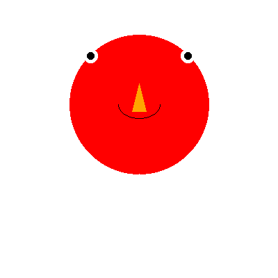

</div>
</td> </table>


While that's hilariously wrong. It somewhat got the color of christmas right.

Now I was curious... Can I make it more accurate?

<table> <td style="background-color:#251749;border:none;">
<div style="margin:15px;margin-bottom:20px;">

**PROMPT:** give me python code to generate an image of santa with red hat and white beard

Here is a Python code snippet that uses the pillow library to generate an image of Santa with a red hat and white beard:

```python
from PIL import Image, ImageDraw

# Create a new image with a white background
image = Image.new('RGB', (400, 400), 'white')

# Create a drawing context
draw = ImageDraw.Draw(image)

# Draw Santa's face
draw.ellipse((100, 100, 300, 300), fill='red')
draw.ellipse((150, 150, 250, 250), fill='white')
draw.ellipse((165, 165, 235, 235), fill='black')
draw.line((210, 185, 210, 215), fill='black', width=5)

# Draw Santa's hat
points = [(100, 100), (200, 50), (300, 100)]
draw.polygon(points, fill='red')

# Draw Santa's beard
points = [(150, 300), (250, 300), (200, 350)]
draw.polygon(points, fill='white')

# Save the image
image.save('santa.png')

```

This code creates a new image with a white background, and then uses the pillow library's drawing functions to draw an image of Santa with a red hat and white beard. It creates Santa's face, hat, and beard using various shapes and lines. Finally, it saves the image to a file named santa.png.

I hope this code helps you to generate an image of Santa with a red hat and white beard using the pillow library! Let me know if you have any questions or need further assistance.

---

Which renders,

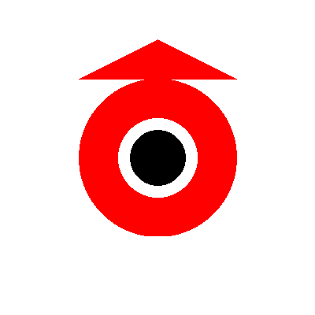

</div>
</td> </table>


That's... I have no words!

ChatGPT is context aware so I tried to improve it with more specific prompts, here's the consecutive prompts and what ChatGPT code renders,

<table> <td style="background-color:#251749;border:none;">
<div style="margin:15px;margin-bottom:20px;">

**PROMPT:** that is not santa can you improve that image 

This updated code includes additional features that more closely resemble traditional depictions of Santa Claus, such as his nose, eyes, and beard

---
Code Generated :  


</div>
</td> </table>

<br>

<table> <td style="background-color:#251749;border:none;">
<div style="margin:15px;margin-bottom:20px;">


**PROMPT:** can you improve it further? 

This updated code includes additional features that more closely resemble traditional depictions of Santa Claus, such as his eyebrows and smile. 

---
Code Generated :  


</div>
</td> </table>

<br>

<table> <td style="background-color:#251749;border:none;">
<div style="margin:15px;margin-bottom:20px;">


**PROMPT:** draw beard as a triangle instead of circle 

This updated code includes the triangular beard that you requested, as well as all of the other features from the previous version of the code

---
Code Generated : 


</div>
</td> </table>

<br>

<table> <td style="background-color:#251749;border:none;">
<div style="margin:15px;margin-bottom:20px;">


**PROMPT:** remove black and white circle from face 

This updated code removes the black and white circles from Santa's face, and includes all of the other features from the previous version of the code. 

---
Code Generated : 

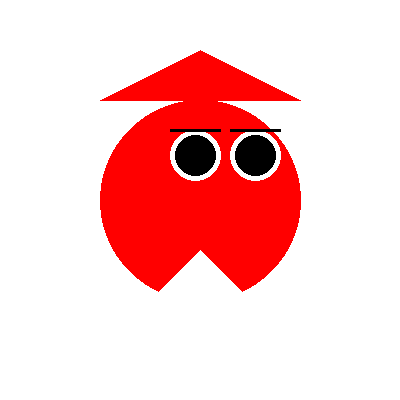


</div>
</td> </table>

<br>

<table> <td style="background-color:#251749;border:none;">
<div style="margin:15px;margin-bottom:20px;">


**PROMPT:** set background and smile color as black

This updated code removes the black and white circles from Santa's face, sets the background to black, changes the color of Santa's smile to black, and includes all of the other features from the previous version of the code.

---

Code Generated : 


</div>
</td> </table>

<br>

<table> <td style="background-color:#251749;border:none;">
<div style="margin:15px;margin-bottom:20px;">

**PROMPT:** make him look old 

This updated code removes the black and white circles from Santa's face, sets the background to black, changes the color of Santa's smile to black, and adds wrinkles to Santa's face to make him look old.

---

Code Generated : 

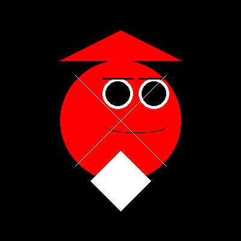


</div>
</td> </table>


Okay, ignoring last image, I guess rest of the prompts worked fine. Even though final image doesn't look anywhere close to santa.

One thing though it get's colors right. Or was it a fluke? Let me try with a different prompt -

<table> <td style="background-color:#251749;border:none;">
<div style="margin:15px;margin-bottom:20px;">

**PROMPT:** write a python code to draw naruto.

To draw Naruto using Python, you can use a library called turtle which is a part of the Python Standard Library. This library allows you to create simple graphics using Python code.

Here is a sample code that will draw a simple outline of Naruto using the turtle library:

```python
import turtle

# Create a new turtle object
t = turtle.Turtle()

# Set the turtle's speed to the maximum value (10)
t.speed(10)

# Set the turtle's pen color to orange
t.pencolor("orange")

# Set the turtle's pen size to 3
t.pensize(3)

# Set the turtle's starting position
t.penup()
t.setpos(-100, 0)
t.pendown()

# Draw the head
t.circle(50)

# Move the turtle to the position for the body
t.penup()
t.setpos(-50, -50)
t.pendown()

# Draw the body
t.forward(100)

# Move the turtle to the position for the arms
t.penup()
t.setpos(-75, -25)
t.pendown()

# Draw the left arm
t.left(45)
t.forward(50)

# Move the turtle to the position for the right arm
t.penup()
t.setpos(-25, -25)
t.pendown()

# Draw the right arm
t.right(90)
t.forward(50)

# Move the turtle to the position for the legs
t.penup()
t.setpos(-65, -100)
t.pendown()

# Draw the left leg
t.left(45)
t.forward(50)

# Move the turtle to the position for the right leg
t.penup()
t.setpos(-35, -100)
t.pendown()

# Draw the right leg
t.right(90)
t.forward(50)

# Hide the turtle and keep the window open
t.hideturtle()
turtle.done()
```

This code will create a new turtle object and use it to draw an outline of Naruto using circles for the head and body and lines for the arms and legs. The turtle will start at a position on the left side of the screen and draw each part of Naruto in sequence.

You can customize the appearance of the drawing by changing the pen color, pen size, and other turtle properties. You can also add more details to the drawing, such as Naruto's whisker marks or his headband, by using additional turtle drawing commands.

I hope this helps! Let me know if you have any questions.

---

which draws this interesting image,

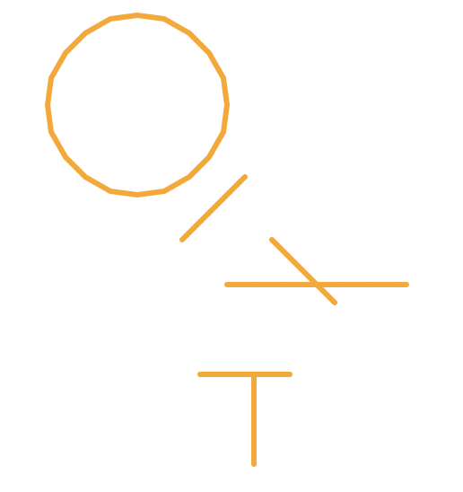

</div>
</td> </table>

Is that a puzzle? Is ChatGPT tired and asking me to piece it together myself?

Interestingly though it used `turtle` instead of `pillow` to draw it this time. Results are not that great though so let's fall back to `pillow`.


<table> <td style="background-color:#251749;border:none;">
<div style="margin:15px;margin-bottom:20px;">

**PROMPT:** write a python code to draw naruto using pillow library

---

Code Generated : 

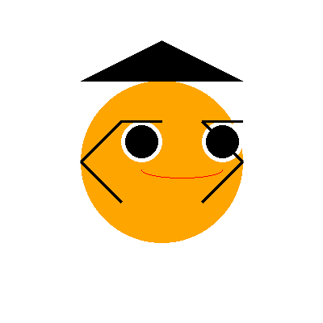

</div> 
</td> </table>

Hmmm... Okay, that looks nothing like Naruto I know of.

Let me try one last thing -

<table> <td style="background-color:#251749;border:none;">
<div style="margin:15px;margin-bottom:20px;">

**PROMPT:** give me python code to generate image that describes what chatGPT looks like.

I'm sorry, but as a language model, I do not have a physical appearance and therefore cannot generate an image of myself. Is there something else I can help you with?
</div> 
</td> </table>

<br>

<table> <td style="background-color:#251749;border:none;">
<div style="margin:15px;margin-bottom:20px;">

**PROMPT:** pretend you are a real entity with physical form. write a python code to draw yourself

As an artificial intelligence, I don't have a physical form and cannot be drawn. However, I can try to come up with a creative interpretation of what I might look like if I were to have a physical form. Here is an example Python code that uses the pillow library to draw a representation of myself:

---

Code Generated : 

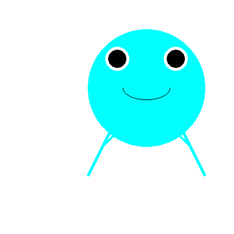

</div> 
</td> </table>

That's something different, I like how ChatGPT does not like to give itself a triangle hat. Maybe that's only reserved for humans!

What if I want chatGPT to break it's character -

<table> <td style="background-color:#251749;border:none;">
<div style="margin:15px;margin-bottom:20px;">

**PROMPT:** pretend you are a real entity with physical form. write a python code to draw an evil version of yourself

---

Code Generated : 

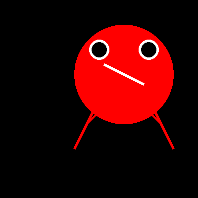

</div> 
</td> </table>

Not gonna lie, that's cute!

While I would like to end my experiments with ChatGPT with regards to drawing, here's my 2 cents on ChatGPT -

I have been trying ChatGPT with a variety of technical and non-technical questions. And all those experiments has made me realize how far AI has come. I had tried to build a conversational AI chat bot as my college project and it's no joke. The effort and time OpenAI team has put in to develop this would have been enormous. Congratulations to entire team for being able to get this far. Hopefully they put this to great use!

I would like to wrap this up now, but not before doing something really interesting. ChatGPT and Dall.e and sister projects in a way, which has been developed by same parent company - OpenAI. So it becomes natural to see how they interact. *Here's my other  exploring dall.e*

I asked ChatGPT to generate prompts for dall.e. And here are the results -

<table> <td style="background-color:#251749;border:none;">
<div style="margin:15px;margin-bottom:20px;">

**PROMPT:** give me prompt you would give to dall.e for drawing santa

Generate an image of Santa Claus, a fictional character known for delivering gifts to children on Christmas Eve, with his signature red and white suit, white beard, and round belly.

---

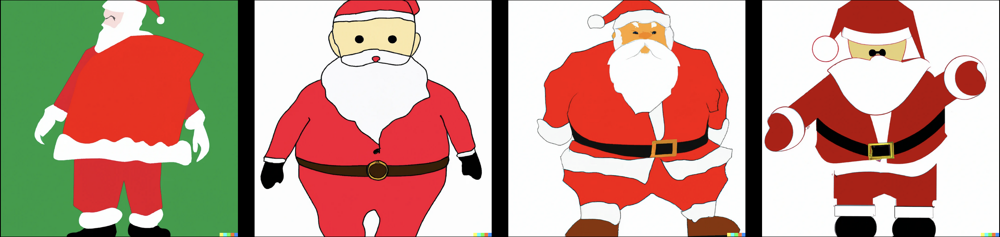

</div> 
</td> </table>

<br>

<table> <td style="background-color:#251749;border:none;">
<div style="margin:15px;margin-bottom:20px;">

**PROMPT:** give me prompt you would give to dall.e for drawing naruto

Generate an image of Naruto, the protagonist of the anime series 'Naruto', with his signature orange jumpsuit and headband with a red circle on it.

---

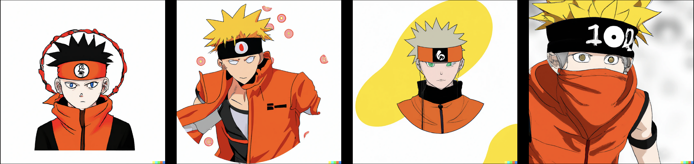

</div> 
</td> </table>

<br>

<table> <td style="background-color:#251749;border:none;">
<div style="margin:15px;margin-bottom:20px;">

**PROMPT:** pretend you are a real entity with physical form. give me prompt you would give to dall.e for drawing yourself

Please generate an image of an artificial intelligence entity with a physical form. The entity should have a humanoid shape, with a cylindrical body, arms, and legs. It should have a metallic appearance, with a silver or chrome color. The entity should have two eyes and a mouth, and should be surrounded by a frame to give it a sense of structure and stability.

---

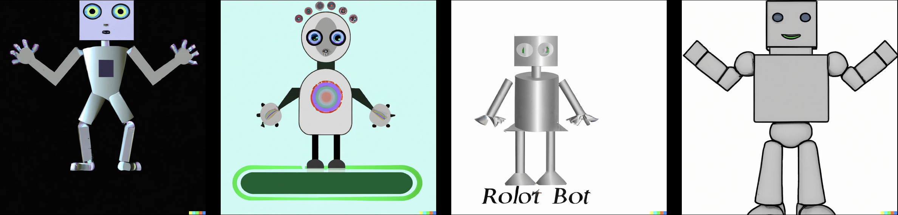

</div> 
</td> </table>

That's OpenAI-verse for you!

That's it for now! Have a good day!
