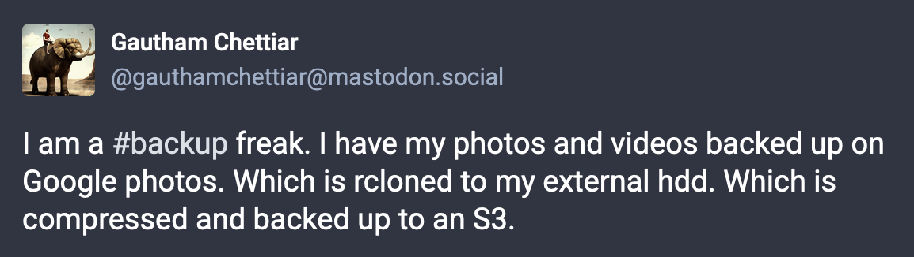
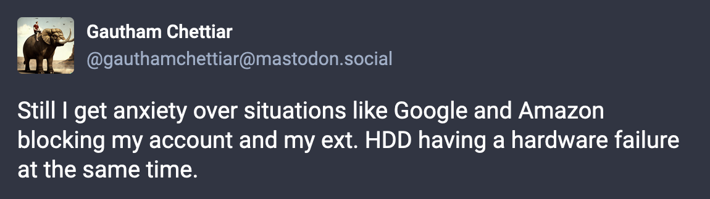

I recently made a post on mastodon on my media backup situation - 

<a href="https://mastodon.social/@gauthamchettiar/110689920549878511"></a>

That was your tldr; and this post is an expansion on why & how I am doing it. 

I have had a bad experience of losing some of my childhood photos due to a corrupted external hard drive. 


I have tried my best to recover the same, but to no avail. Since then, I had made it a habit to backup every single media I own on multiple locations. 

Initially, I was happy by just letting Google Photos back it up. Heck, it even provides a lot of add on features like creating memories and collages along with providing date, face, location and context based search. This is something that's too convenient to not have. It is this feature that is making me to overlook all the privacy concerns I have with a conglomerate like Google having all my personal media. 

But then I came across several articles where people had posted their experience with Google randomly blocking their account, or more than Google I would say Google's content moderation AI randomly [blacklisting and blocking accounts](https://news.ycombinator.com/item?id=24791357). Or your google account getting blocked and Google's support team saying - "[Not my problem!](https://news.ycombinator.com/item?id=30677471)".

Just take a look at a simple [`"google account"` search on hackernews](https://hn.algolia.com/?dateRange=all&page=0&prefix=false&query=google%20account%20&sort=byPopularity&type=story) which is filled with all kind of horror stories of people losing their account and being unable to recover it.

Allow me to rant on it for a bit - 

I have my entire life connected to a google account. Everything from my social accounts to my personal identification documents are linked to my personal gmail account. Losing it would of course be devastating. Not to mention the days that must be spent post that, trying to recover other accounts and services. In some sort this is a single point of failure scenario. 

This is something we overlook due to our trust in Google. But just think how much of a problem it would be if you one day suddenly lost your account? What if it got hacked? What if you forgot your password and lost your phone at the same time?

Sigh...

Okay, now getting to point. I didn't want to rely on just Google Photos backup so I decided to also back it up to an external HDD. Now there's 2 ways to do it really -

1. Ask Google nicely to provide a zip of all media on drive and google photos using [google takeout](https://support.google.com/accounts/answer/3024190?hl=en). 
2. Pull data out of Google periodically using rclone.

Well apart from being considerate about google resources there is no other benefit of first approach. It does not allow you to have incremental backups. So now if you want to backup any media uploaded to Google Photos after your takeout order, you need to do a complete takeout again. This would have worked if I had decided to completely move away from Photos, but that was not the case for me. So this is not a viable option. 

So I chose the second option. For those unaware, [rclone](https://rclone.org/) is a incremental backup tool that takes care of syncing/cloning data between 2 locations. It provides a wide selection of [providers](https://rclone.org/#providers) (sources and targets). Luckily for me Google Photos was one of the supported source. 

All I had to do was setup the Google Photos provider following [this](https://rclone.org/googlephotos/) instruction and now every time I wanted to initiate a sync I only had to run below command - 

```bash
rclone copy gphotos:media/by-month "<local-path-to-pictures-folder>/gphotos-sync"
```

Initially this will take time as it will download all the photos. But then for incremental backups, it should be faster as `rclone` would look at all the media and download only those which was newly added. 

This was a game changer for me. Not only did it do necessary sync, it also nicely segregated them into year/month buckets (notice `media/by-month` option in command?) - 

```
.
├── 2020
│   ├── 2020-10
│   ├── 2020-11
│   └── 2020-12
├── 2021
│   ├── 2021-01
│   ├── 2021-02
│   ├── 2021-03
├── 2022
│   ├── 2022-01
│   ├── 2022-02
│   ├── 2022-11
│   └── 2022-12
└── 2023
    ├── 2023-05
    ├── 2023-06
    └── 2023-07
```

Hurrah!!! All Done Right? 

Not Really...

Remember why I originally became a backup freak? It was because my external HDD failed. So for me, keeping them in Google Photos and my external HDD was still not acceptable enough. 

So I decided to take a backup of the backup. 

I knew, I wanted to back them up to a cloud storage like S3. I knew I want to use the archival storage feature "Glacier" to make sure it costs me pennies to store it for long term. But there was a problem. 

Number of individual media files I had were in thousands. If I were to back them up individually It will cost me a lot more in PUT/GET requests *(believe me I have been burnt before by this)* along with storage costs. So compressing them into a single tar file and uploading them made sense. 

Actually, I took a middle ground approach and decided to zip each individual Year/Month folder. This offered some flexibility while not burning my wallet.

```bash
cd "<local-path-to-pictures-folder>/gphotos-sync/"
find . -mindepth 2 -type d -exec tar -czvf {}.tar.gz {} \;
find . -iname "*.tar.gz" -exec mv {} ../s3-backup/gphotos-sync/ \;
```

```
.
├── 2020-10.tar.gz
├── 2020-11.tar.gz
├── 2020-12.tar.gz
├── 2021-01.tar.gz
├── 2021-02.tar.gz
├── 2021-03.tar.gz
├── 2022-01.tar.gz
├── 2022-02.tar.gz
├── 2022-11.tar.gz
├── 2022-12.tar.gz
├── 2023-05.tar.gz
├── 2023-06.tar.gz
└── 2023-07.tar.gz
```

Now all I had to do was simply copy them over to my S3 bucket -
```bash
cd ../s3-backup/
aws s3 mv --recursive "gphotos-sync/" "s3://<bucket-name>/gphotos-sync"
```

I made sure to change the storage class on `s3://<bucket-name>/gphotos-sync` to Glacier Deep Archive. And Voila, my cost effective backup of the backup was ready. 

If you are wondering how I take incremental backups, it's pseudo manual for now. I run below script and provide a filter parameter, which will compress and upload only the filtered folder.

```bash
# backup.sh 2023-*
filter=$1

cd "<local-path-to-pictures-folder>/gphotos-sync/"
find . -mindepth 2 -type d -iname $filter -exec tar -czvf {}.tar.gz {} \;
find . -iname "*.tar.gz" -exec mv {} ../s3-backup/gphotos-sync/ \;

cd ../s3-backup/
aws s3 mv --recursive "gphotos-sync/" "s3://<bucket-name>/gphotos-sync"
```

So, this backup solution should have provided me with some peace of mind right? 

Actually...

<a href="https://mastodon.social/@gauthamchettiar/110689920549878511"> </a>

Sigh... x2

I would love to hear about your backup solutions -> feel free to get in [touch](/contact) with me.